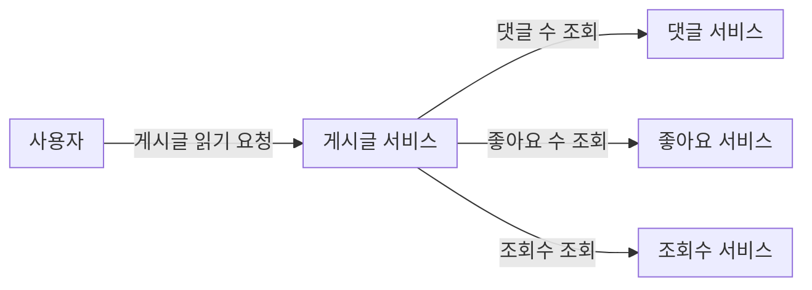
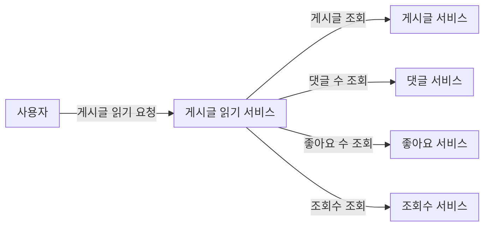
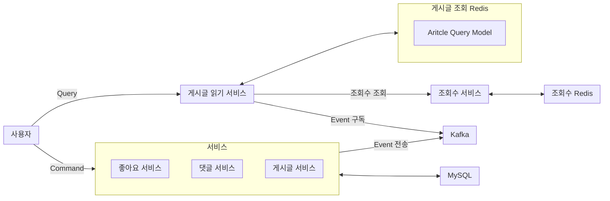
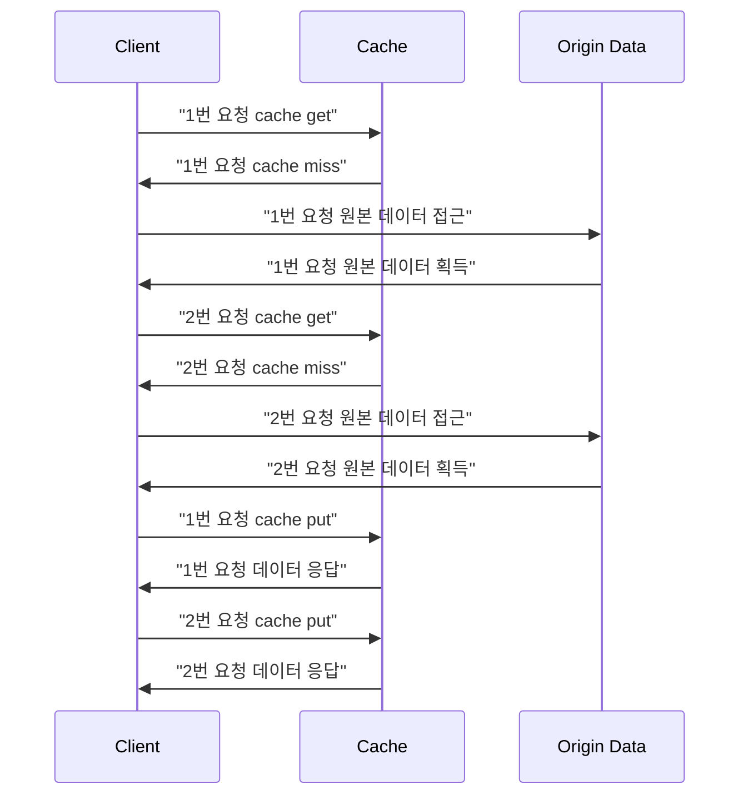
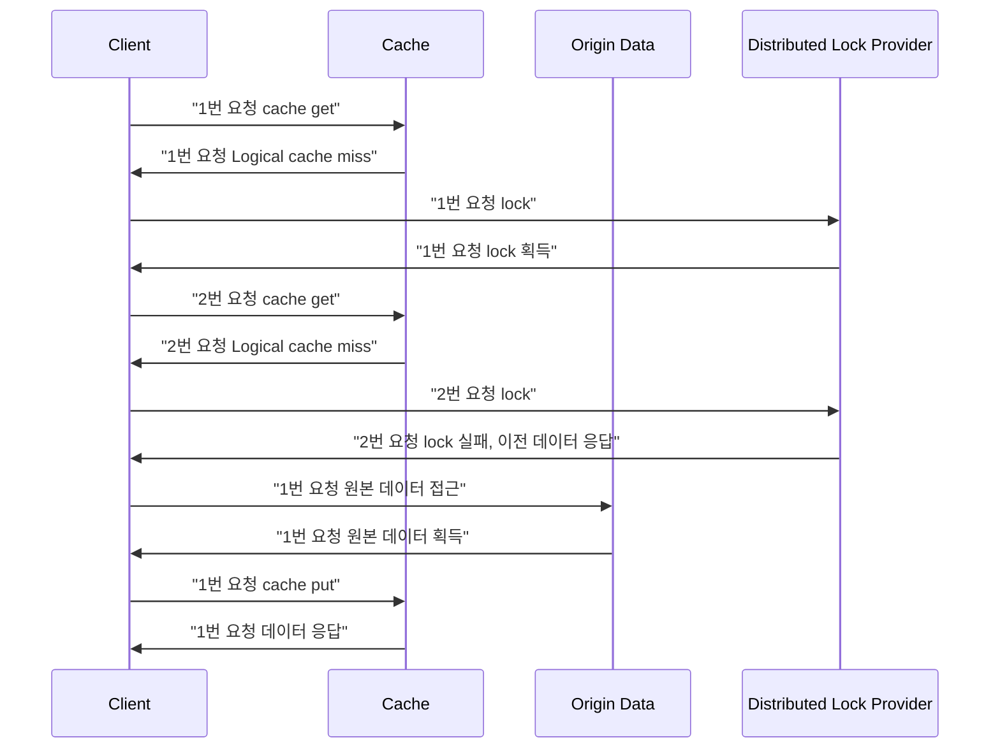

<!-- ### 강의 : [스프링부트로 대규모 시스템 설계 - 게시판](https://www.inflearn.com/course/%EC%8A%A4%ED%94%84%EB%A7%81%EB%B6%80%ED%8A%B8%EB%A1%9C-%EB%8C%80%EA%B7%9C%EB%AA%A8-%EC%8B%9C%EC%8A%A4%ED%85%9C%EC%84%A4%EA%B3%84-%EA%B2%8C%EC%8B%9C%ED%8C%90/dashboard) -->

# 대규모 시스템으로 설계된 게시판의 구조 - Article Read

## 0. 서비스 별로 다루는 기술들

|No|서비스|목적|기술|
|---|---|---|---|
|1|Article|게시글 관리|DB Index(clustered, secondary, covering index), 페이징(limit, offset)|
|2|Comment|댓글 관리|2 depth(인접리스트), 무한 depth(경로 열거)|
|3|Like|좋아요 관리|일관성(Transaction), 동시성(pessimistic, optimistic lock, 비동기 순차처리)|
|4|View|조회수 관리|Redis, TTL을 통한 Distributed Lock|
|5|Hot Article|인기글 관리|Consumer-Event Driven Architecture / Producer-Transactional Message(Transactional Outbox), shard key coordinator|
|6|Article Read|게시글 조회 개선|CQRS, Redis Cache, Request Collapsing|

## 1. Article Read

### 1-1. 게시글 읽기의 문제점

MSA로 개발된 게시글, 댓글, 좋아요, 조회수 서비스는 아래와 같은 구조이고 게시판 특성상 게시글 쓰기 요청 보다 게시글 읽기 요청이 훨씬 많다.   
이런 구조와 요청의 특성 상 다음과 같은 문제가 있다.   

- 각 서비스는 MSA로 개발 되었는데 서비스간 결합도가 높아지고 서비스간 순환 참조가 발생한다.
- 게시글 읽기 요청의 부하가 다른 서비스에 전달된다.
- 게시글 읽기 요청이 늘어나 서비스를 추가로 실행하면, 게시글 서비스에 읽기/쓰기 기능이 같이 있어 사용하지 않는 쓰기 리소스도 더 늘어난다.



### 1-2. 게시글 읽기 서비스 추가

문제점들을 해결하기 위해 게시글 읽기만 처리하는 서비스를 아래와 같이 개발한다.   
읽기 트래픽에 대해서만 독립적으로 확장할 수 있고 서비스 간의 순환 참조를 해결할 수 있다.   
그러나 데이터가 각 서비스와 DB에 분산되어 있어 게시글 읽기 요청을 처리하기 위한 비요이 증가하고 각 서비스에 부하가 전파된다.   
이 문제를 해결하기 위해 CQRS(Command and Query Responsibility Segregation) 구조를 사용해 읽기와 쓰기 요청을 독립적으로 관리한다.   



### 1-3. CQRS(Command and Query Responsibility Segregation)

CQRS 구조는 데이터에 대한 변경과 조회 작업을 분리한다.   
게시글 조회에 필요한 게시글, 댓글, 좋아요, 조회수 정보의 추가, 삭제, 수정 요청은 기존 서비스에서 처리하고 이벤트를 Kafka에 보낸다.   
Kafka에 이벤트를 보내는 방법은 인기글 서비스에서 설명한 Transactional Outbox 패턴을 사용해 보낸다.   

<br/>

게시글 읽기 서비스는 읽기 요청을 처리하기 위한 Article Query Model을 관리한다.    
Article Query Model은 게시글에 대한 정보, 댓글 수, 좋아요 수를 갖고 있고 Kafka에서 이벤트를 받아 최신 정보로 수정한다.   

<br/>

조회수 정보는 조회수 변경 요청이 많아 이벤트를 받아 처리하면 많은 이벤트가 발생해 부하가 발생할 수 있다.    
조회수 정보는 Redis에서 관리해 비교적 빠르게 응답할 수 있어 게시글 읽기 요청 마다 조회수 서비스에 직접 요청해 가져온다.

<br/>

데이터를 변경하는 Command 요청과 데이터를 읽는 Query 요청을 분리해 서비스 간 결합도를 줄이고 순환 참조를 없앨 수 있다.   
그리고 성능을 높이고 조회와 명령에 관련된 서비스를 독립적으로 확장할 수 있다.    



### 1-4. 게시글 읽기 최적화

트래픽이 많은 읽기 요청 부하를 다른 서비스에 전파하지 않기 위해 게시글 읽기 서비스에서 별도의 Article Query Model을 Redis에서 관리한다.   
Article Query Model 정보를 최신화 하기 위해 다른 서비스에 요청을 하지 않고 이벤트를 받아 갱신한다.   
이벤트를 받아 갱신하는 방법은 인기글 서비스에서 동작한 방법과 동일하게 각 EventPayload에 맞는 EventHandler가 동작해 갱신한다.   
사용자가 요청한 정보가 Redis에 없을 때는 각 서비스에 필요한 정보를 요청한다.   

```java
@Slf4j
@Component
@RequiredArgsConstructor
public class ArticleReadEventConsumer {
    private final ArticleReadService articleReadService;

    @KafkaListener(topics = {
            EventType.Topic.TRAFFIC_BOARD_LIKE,
            EventType.Topic.TRAFFIC_BOARD_COMMENT,
            EventType.Topic.TRAFFIC_BOARD_ARTICLE
    })
    public void listen(String message, Acknowledgment ack) {
        log.info("[ArticleReadEventConsumer.listen] message={}", message);
        Event<EventPayload> event = Event.fromJson(message);
        if (event != null) {
            articleReadService.handleEvent(event);
        }
        ack.acknowledge();
    }
}

@Component
@RequiredArgsConstructor
public class ArticleCreatedEventHandler implements EventHandler<ArticleCreatedEventPayload> {
    private final ArticleIdListRepository articleIdListRepository;
    private final BoardArticleCountRepository boardArticleCountRepository;
    private final ArticleQueryModelRepository articleQueryModelRepository;

    @Override
    public void handle(Event<ArticleCreatedEventPayload> event) {
        ArticleCreatedEventPayload payload = event.getPayload();
        articleQueryModelRepository.create(
                ArticleQueryModel.create(payload),
                Duration.ofDays(1)
        );

        articleIdListRepository.add(payload.getBoardId(), payload.getArticleId(), 1000L);
        boardArticleCountRepository.createOrUpdate(payload.getBoardId(), payload.getBoardArticleCount());
    }

    @Override
    public boolean supports(Event<ArticleCreatedEventPayload> event) {
        return EventType.ARTICLE_CREATED == event.getType();
    }
}

@Repository
@RequiredArgsConstructor
public class ArticleQueryModelRepository {
    private final StringRedisTemplate redisTemplate;

    // article-read::article::{articleId}
    private static final String KEY_FORMAT = "article-read::article::%s";

    public void create(ArticleQueryModel articleQueryModel, Duration ttl) {
        redisTemplate.opsForValue()
                .set(generateKey(articleQueryModel), DataSerializer.serialize(articleQueryModel), ttl);
    }

    public void update(ArticleQueryModel articleQueryModel) {
        redisTemplate.opsForValue().setIfPresent(generateKey(articleQueryModel), DataSerializer.serialize(articleQueryModel));
    }

    public void delete(Long articleId) {
        redisTemplate.delete(generateKey(articleId));
    }
    ...
}

@Getter
public class ArticleQueryModel {
    private Long articleId;
    private String title;
    private String content;
    private Long boardId;
    private Long writerId;
    private LocalDateTime createdAt;
    private LocalDateTime modifiedAt;
    private Long articleCommentCount;
    private Long articleLikeCount;

    ...
}
```

#### 1-4-1. 게시글 읽기 서비스에서 다루는 캐시 정보

|Category|Subject|Key|Update Condition|
|---|---|---|---|
|게시글 목록|Article ID List|article-read::board::{boardId}::article-list|Article Create/Delete|
|게시글 목록|Article Query Model|article-read::article::{articleId}|Article Create/Delete, Comment Create/Delete, Like/Unlike|
|게시글 수|Board Article Count|article-read::board-article-count::board::{boardId}|Article Create/Delete|
|조회수|Article View Count|articleViewCount|@Cacheable에서 갱신|

#### 1-4-2. 게시글 단건 조회

사용자가 요청한 게시글 정보가 Redis에 article-read::article::{articleId} 키 값으로로 있으면 가져온다.   
가져온 정보는 ArticleQueryModel 형식이다.   
없으면 게시글, 댓글, 좋아요, 조회수 서비스에 필요한 정보를 요청해 가져온다.

```java
@Slf4j
@Service
@RequiredArgsConstructor
public class ArticleReadService {
    private final ArticleClient articleClient;
    private final CommentClient commentClient;
    private final LikeClient likeClient;
    private final ViewClient viewClient;
    private final ArticleIdListRepository articleIdListRepository;
    private final ArticleQueryModelRepository articleQueryModelRepository;
    private final BoardArticleCountRepository boardArticleCountRepository;
    private final List<EventHandler> eventHandlers;

    public void handleEvent(Event<EventPayload> event) {
        for (EventHandler eventHandler : eventHandlers) {
            if (eventHandler.supports(event)) {
                eventHandler.handle(event);
            }
        }
    }

    public ArticleReadResponse read(Long articleId) {
        ArticleQueryModel articleQueryModel = articleQueryModelRepository.read(articleId)
                .or(() -> fetch(articleId))
                .orElseThrow();

        return ArticleReadResponse.from(
                articleQueryModel,
                viewClient.count(articleId)
        );
    }
    ...
}

@Repository
@RequiredArgsConstructor
public class ArticleQueryModelRepository {
    private final StringRedisTemplate redisTemplate;

    // article-read::article::{articleId}
    private static final String KEY_FORMAT = "article-read::article::%s";

    public void create(ArticleQueryModel articleQueryModel, Duration ttl) {
        redisTemplate.opsForValue()
                .set(generateKey(articleQueryModel), DataSerializer.serialize(articleQueryModel), ttl);
    }

    public void update(ArticleQueryModel articleQueryModel) {
        redisTemplate.opsForValue().setIfPresent(generateKey(articleQueryModel), DataSerializer.serialize(articleQueryModel));
    }

    public void delete(Long articleId) {
        redisTemplate.delete(generateKey(articleId));
    }

    public Optional<ArticleQueryModel> read(Long articleId) {
        return Optional.ofNullable(
                redisTemplate.opsForValue().get(generateKey(articleId))
        ).map(json -> DataSerializer.deserialize(json, ArticleQueryModel.class));
    }

    private String generateKey(ArticleQueryModel articleQueryModel) {
        return generateKey(articleQueryModel.getArticleId());
    }

    private String generateKey(Long articleId) {
        return KEY_FORMAT.formatted(articleId);
    }

    public Map<Long, ArticleQueryModel> readAll(List<Long> articleIds) {
        List<String> keyList = articleIds.stream().map(this::generateKey).toList();
        return redisTemplate.opsForValue().multiGet(keyList).stream()
                .filter(Objects::nonNull)
                .map(json -> DataSerializer.deserialize(json, ArticleQueryModel.class))
                .collect(Collectors.toMap(ArticleQueryModel::getArticleId, Function.identity()));
    }
}
```

#### 1-4-3. 페이징(게시글 목록 조회, 게시글 수)

페이징 기능을 위해 게시글 목록 조회와 게시글 수에 대한 정보가 필요하다.   
게시글 목록은 Redis에 article-read::board::{boardId}::article-list 키로 관리하고 최근 1,000개의 게시글 ID를 리스트 형식으로 관리한다.    
사용자가 요청한 페이지의 게시글 목록이 Redis에 없으면 게시글 서비스에 직접 요청한다.   
게시글 목록 정보에서 게시글 정보를 가져오기 위해 Redis에서서 article-read::article::{articleId} 키로 ArticleQueryModel을 가져온다.    
찾는 게시글이 없으면 게시글 서비스에 직접 요청한다.   

<br/>

게시판 별 게시글 개수는 Redis에 article-read::board-article-count::board::{boardId} 키로 관리하고 게시글의 개수를 저장한다.   
찾는 게시판의 게시글 개수가 없으면 게시글 서비스에 직접 요청한다.   

```java
@Slf4j
@Service
@RequiredArgsConstructor
public class ArticleReadService {
    private final ArticleClient articleClient;
    private final CommentClient commentClient;
    private final LikeClient likeClient;
    private final ViewClient viewClient;
    private final ArticleIdListRepository articleIdListRepository;
    private final ArticleQueryModelRepository articleQueryModelRepository;
    private final BoardArticleCountRepository boardArticleCountRepository;
    private final List<EventHandler> eventHandlers;

    ...

    private Optional<ArticleQueryModel> fetch(Long articleId) {
        Optional<ArticleQueryModel> articleQueryModelOptional = articleClient.read(articleId)
                .map(article -> ArticleQueryModel.create(
                        article,
                        commentClient.count(articleId),
                        likeClient.count(articleId)
                ));
        articleQueryModelOptional.ifPresent(articleQueryModel -> articleQueryModelRepository.create(articleQueryModel, Duration.ofDays(1)));
        log.info("[ArticleReadService.fetch] fetch data. articleId={}, isPresent={}", articleId, articleQueryModelOptional.isPresent());
        return articleQueryModelOptional;
    }

    public ArticleReadPageResponse readAll(Long boardId, Long page, Long pageSize) {
        return ArticleReadPageResponse.of(
                readAll(
                        readAllArticleIds(boardId, page, pageSize)
                ),
                count(boardId)
        );
    }

    private List<ArticleReadResponse> readAll(List<Long> articleIds) {
        Map<Long, ArticleQueryModel> articleQueryModelMap = articleQueryModelRepository.readAll(articleIds);
        return articleIds.stream()
                .map(articleId -> articleQueryModelMap.containsKey(articleId) ?
                        articleQueryModelMap.get(articleId) :
                        fetch(articleId).orElse(null))
                .filter(Objects::nonNull)
                .map(articleQueryModel ->
                        ArticleReadResponse.from(
                                articleQueryModel,
                                viewClient.count(articleQueryModel.getArticleId())
                        ))
                .toList();
    }

    private List<Long> readAllArticleIds(Long boardId, Long page, Long pageSize) {
        List<Long> articleIds = articleIdListRepository.readAll(boardId, (page - 1) * pageSize, pageSize);
        if (pageSize == articleIds.size()) {
            log.info("[ArticleReadService.readAllArticleIds] return redis data.");
            return articleIds;
        }
        log.info("[ArticleReadService.readAllArticleIds] return origin data.");
        return articleClient.readAll(boardId, page, pageSize).getArticles().stream()
                .map(ArticleClient.ArticleResponse::getArticleId)
                .toList();
    }

    private long count(Long boardId) {
        Long result = boardArticleCountRepository.read(boardId);
        if (result != null) return result;

        long count = articleClient.count(boardId);
        boardArticleCountRepository.createOrUpdate(boardId, count);
        return count;
    }
    ...
}

@Repository
@RequiredArgsConstructor
public class ArticleIdListRepository {
    private final StringRedisTemplate redisTemplate;

    // article-read::board::{boardId}::article-list
    private static final String KEY_FORMAT = "article-read::board::%s::article-list";

    ...

    public List<Long> readAll(Long boardId, Long offset, Long limit) {
        return redisTemplate.opsForZSet()
                .reverseRange(generateKey(boardId), offset, offset + limit -1)
                .stream().map(Long::valueOf).toList();
    }
    ...
}

@Repository
@RequiredArgsConstructor
public class BoardArticleCountRepository {
    private final StringRedisTemplate redisTemplate;

    // article-read::board-article-count::board::{boardId}
    private static final String KEY_FORMAT = "article-read::board-article-count::board::%s";

    public void createOrUpdate(Long boardId, Long articleCount) {
        redisTemplate.opsForValue().set(generateKey(boardId), String.valueOf(articleCount));
    }

    public Long read(Long boardId) {
        String result = redisTemplate.opsForValue().get(generateKey(boardId));
        return result == null ? 0L : Long.valueOf(result);
    }

    private String generateKey(Long boardId) {
        return KEY_FORMAT.formatted(boardId);
    }
}
```

#### 1-4-4. 조회수

Spring에서 제공하는 Redis Cache를 사용해 조회수 정보를 가져온다.   
조회수를 가져오는 ViewClient.count는 @Cacheable(key = "#articleId", value = "articleViewCount") 애노테이션이 추가되어 있어,    
Redis의 articleViewCount에 articleId를 Key로 갖는 값이 있으면 가져오고 없으면 메소드가 실행되어 조회수 서비스에 직접 요청해 응답을 리턴한다.   
메소드에서 응답한 값은 articleViewCount에 articleId를 Key로 저장된다.   
Spring에서 제공하는 Redis Cache의 자세한 내용은 [요소 기술-Repository](https://5-sh.github.io/spring/2025/03/24/traffic-board-repository.html)에서 설명되어 있다.   

```java
@Slf4j
@Service
@RequiredArgsConstructor
public class ArticleReadService {
    private final ArticleClient articleClient;
    private final CommentClient commentClient;
    private final LikeClient likeClient;
    private final ViewClient viewClient;
    private final ArticleIdListRepository articleIdListRepository;
    private final ArticleQueryModelRepository articleQueryModelRepository;
    private final BoardArticleCountRepository boardArticleCountRepository;
    private final List<EventHandler> eventHandlers;

    ...

    public ArticleReadResponse read(Long articleId) {
        ArticleQueryModel articleQueryModel = articleQueryModelRepository.read(articleId)
                .or(() -> fetch(articleId))
                .orElseThrow();

        return ArticleReadResponse.from(
                articleQueryModel,
                viewClient.count(articleId)
        );
    }
    ...
}

@Slf4j
@Component
@RequiredArgsConstructor
public class ViewClient {
    private RestClient restClient;
    @Value("${endpoints.traffic-board-view-service.url}")
    private String viewServiceUrl;

    @PostConstruct
    public void initRestClient() {
        restClient = RestClient.create(viewServiceUrl);
    }

    @Cacheable(key = "#articleId", value = "articleViewCount")
    public long count(Long articleId) {
        log.info("[ViewClient.count] articleId={}", articleId);
        try {
            return restClient.get()
                    .uri("/v1/article-views/articles/{articleId}/count", articleId)
                    .retrieve()
                    .body(Long.class);
        } catch (Exception e) {
            log.error("[ViewClient.count] articleId={}", articleId, e);
            return 0;
        }
    }
}

@Configuration
@EnableCaching
public class CacheConfig {
    @Bean
    public RedisCacheManager cacheManager(RedisConnectionFactory connectionFactory) {
        return RedisCacheManager.builder(connectionFactory)
                .withInitialCacheConfigurations(
                        Map.of(
                                "articleViewCount", RedisCacheConfiguration.defaultCacheConfig().entryTtl(Duration.ofSeconds(1))
                        )
                )
                .build();
    }
}
```

### 1-5. 캐시 최적화(Request Collapsing)

조회수 캐시는 TTL이 1s로 짧고 많은 조회수 요청이 들어온다.   
게시글 읽기 요청이 동시에 많이 들어오고 조회수 캐시 값이 없으면 캐시 동기화를 위해 View 서비스에 중복으로 요청을 보낼 수 있다.    

<br/>

1번 요청이 cache miss가 나서 View 서비스에 조회수 정보를 요청하고 Redis에 추가하기 전에 2번 요청이 들어온다.   
2번 요청도 cache miss가 나고 View 서비스에 조회수 정보를 요청한다. 그리고 응답을 받으면 Redis에 갱신한다.   
View 서비스 요청과 Redis 갱신은 한 번만 하면 되는데, 불필요하게 중복되어 View 서비스에 요청이 몰릴 수 있다.   



이 문제를 해결하기 위해 cache의 TTL을 Logical TTL과 Physical TTL로 나눠 운영한다.   
Physical TTL 값을 Logical TTL 값보다 크게 설정하고 Redis에는 physical TTL로 설정한다.   
cache hit 유무는 Logical TTL로 결정하고 1번 요청이 cache miss가 나면 Distributed Lock을 걸고 View 서비스에 요청을 하고 응답 값을 Redis에 갱신한다.   
그 사이 들어오는 2번 요청은 cache miss가 발생해 Distribute Lock을 걸려 하지만 이미 1번 요청이 Lock을 한 상태 이므로 Redis에 저장된 이전 캐시 값을 응답한다.   
Logical TTL보다 Physical TTL이 길기 때문에 Redis에서 이전 캐시 값을 응답할 수 있다.   
이 과정에서 최신이 아닌 조회수 정보가 응답되지만 조회수 정보의 정합성은 크게 중요하지 않기 때문에 허용한다.   
Distributed Lock은 조회수 서비스에서 어뷰징 방지로 사용한 Distributed Lock과 동일하게 Redis의 TTL과 setIfAbsent 메소드를 사용해 구현한다.   

