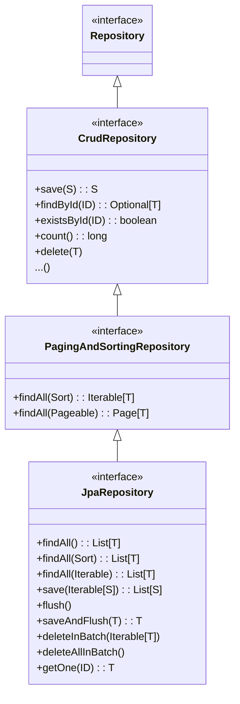

### 강의 : [실전! 스프링 데이터 JPA](https://www.inflearn.com/course/%EC%8A%A4%ED%94%84%EB%A7%81-%EB%8D%B0%EC%9D%B4%ED%84%B0-JPA-%EC%8B%A4%EC%A0%84)

### 1. 순수 JPA 기반 Repository

```MemberJpaRepository```와 ```TeamJpaRepository```는 ```@PersistenceContext``` 애노테이션을 사용해 EntityManager를 명시적으로 주입받아 사용하는 JPA 기반 Repository 이다.   

```java
@Repository
public class MemberJpaRepository {

    @PersistenceContext
    private EntityManager em;

    public Member save(Member member) {
        em.persist(member);
        return member;
    }

    public void delete(Member member) {
        em.remove(member);
    }

    public List<Member> findAll() {
        return em.createQuery("select m from Member m", Member.class).getResultList();
    }

    public Optional<Member> findById(Long id) {
        return Optional.ofNullable(em.find(Member.class, id));
    }

    public long count() {
        return em.createQuery("select count(m) from Member m", Long.class).getSingleResult();
    }

    public Member find(Long id) {
        return em.find(Member.class, id);
    }
    ...
}

@Repository
public class TeamJpaRepository {

    @PersistenceContext
    EntityManager em;

    public Team save(Team team) {
        em.persist(team);
        return team;
    }

    public void delete(Team team) {
        em.remove(team);
    }

    public List<Team> findAll() {
        return em.createQuery("select t from Team t", Team.class).getResultList();
    }

    public Optional<Team> findById(Long id) {
        return Optional.ofNullable(em.find(Team.class, id));
    }

    public long count() {
        return em.createQuery("select count(t) from Team t", Long.class).getSingleResult();
    }
}
```

### 2. 공통 인터페이스

순수 JPA로 Repository를 개발하는 대신, 스프링 데이터 JPA가 제공하는 공통 인터페이스를 사용한다.   

```org.springframework.data.repository.Repository```를 구현한 클래스는 스프링 데이터 JPA의 스캔 대상이 된다.   
컴포넌트 스캔을 스프링 데이터 JPA가 자동으로 처리하기 때문에 ```@Repository``` 애노테이션을 생략할 수 있다.   

JPA 예외를 스프링 예외로 변환하는 과정도 자동으로 처리한다.   
Repository 계층에서 JPA 구현체, JbdcTemplate 등의 기술을 사용할 수 있고, 사용하는 기술에 따라 발생하는 예외가 다르다.   
스프링은 클라이언트는 특정 기술에 종속되지 않고 영속성 계층을 사용할 수 있도록 추상화를 제공하고,    
기술에 따라 다르게 발생하는 예외를 공통된 스프링 예외로 변환할 수 있도록 지원한다.   

그리고 ```org.springframework.data.repository.Repository```를 구현한 Repository를 실제 출력해 보면 ```class comm.sun.proxy.$ProxyXXX```로 나오고 프록시 객체인 것을 알 수 있다.   
실제로 공통 인터페이스를 구현한 클래스는 스프링 데이터 JPA가 내부적으로 생성한다.   

```java
public interface MemberRepository extends JpaRepository<Member, Long>, MemberRepositoryCustom {
}

public interface TeamRepository extends JpaRepository<Team,Long> {
}
```

```MemberJpaRepository```에서 구현한 ```save(Member member)```, ```delete(Member member)```, ```List<Member> findAll()```, ```Optional<Member> findById(Long id)```, ```count()```, ```Member find(Long id)``` 메소드를 ```MemberRepository```에서 별도의 구현 없이 동일하게 지원한다.   

JpaRepository 인터페이스는 공통 CRUD를 제공하기 위해 제네릭을 <엔티티 타입, 식별자 타입>으로 설정해야 한다.   
공통 인터페이스는 아래와 같이 구성되어 있다.   



스프링 데이터는 ```Repository```, ```CrudRepository```, ```PagingAndSortingRepository```를 갖고 있고 스플이 데이터 JPA는 ```JpaRepository```를 갖고 있다.   

제네릭 타입 ```T```: 엔티티, ```ID```: 엔티티의 식별자 타입, ```S```: 엔티티와 그 자식 타입을 나타낸다.   

주요 메서드는 아래와 같다.   
- ```save(S)```: 새로운 엔티티는 저장하고 이미 이는 엔티티는 병합한다.
- ```delete(T)```: 엔티티 하나를 삭제한다. 내부에서 ```EntityManager.remove()``` 호출
- ```findById(ID)```: 엔티티 하나를 조회한다. 내부에서 ```EntityManager.find()``` 호출
- ```getOne(ID)```: 엔티티를 프록시로 조회한다. 내부에서 ```EntityManager.getReference()```호출
- ```findAll(...)```: 모든 엔티티를 조회한다 정렬(```Sort```)이나 페이징(```Pageable```)조건을 파라미터로 제공할 수 있다.
