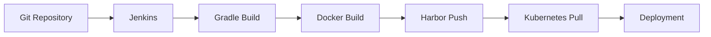

# 5. CI/CD 환경
virtualbox에 vagrant로 프로비저닝한 환경에 harbor와 jenkins를 구성하기엔 리소스가 모자랄 것으로 예상해 로컬 PC 기반 CI/CD + k8s 배포 파이프라인 구축   

```
[개발 코드]
   ↓
[Jenkins (빌드)]
   ↓
[Docker 이미지 생성]
   ↓
[Harbor (이미지 저장소)]
   ↓
[Kubernetes (이미지 pull → 배포)]
```
## 5-1. 작업 순서
1. Harbor 구축 (이미지 저장소)
- Docker Registry 역할
- k8s가 여기서 이미지 pull

2. Jenkins 구축 (CI/CD 서버)
- 코드 빌드
- Docker 이미지 생성
- Harbor로 push

3. Docker ↔ Harbor 연결
- docker login
- 이미지 push 테스트

4. Kubernetes ↔ Harbor 연결
- imagePullSecret 설정
- Pod에서 Harbor 이미지 pull 가능하게

5. Jenkins Pipeline 구성 (Jenkinsfile)
- git pull
- build
- docker build
- docker push
- kubectl apply

## 5-2. harbor

### 5-2-1. 설치

harbor는 nginx(gateway), harbor-core(API), harbor-db(postgres), redis, registry로 구성된 마이크로 서비스 구조   
여러 컨테이너를 묶어서 실행하기 위해 docker compose로 설치   

```bash
wsl --install -d Ubuntu
```

Docker Desktop WSL integration 기능이 Ubuntu를 Docker CLI를 사용 가능한 상태로 연결해 Ubuntu WSL에서 작업한 내용이 docker-desktop에 전달됨   

```
[Ubuntu WSL]  ← 작업하는 환경
      ↓
[docker CLI]
      ↓
[docker-desktop WSL (Docker Engine)]
      ↓
[컨테이너 실행]
```

### docker-desktop WLS 특징

- 도커를 돌리기 위한 내부 OS
- 실제 Docker 서버(엔진)
- Docker 엔진 전용 내부 환경
- 최소 구성 (busybox 수준)
- 패키지 설치 거의 불가
- sudo, apt, systemctl 없음
- Harbor 같은 복잡한 서비스 설치 불가

### Ubuntu WSL이 필요한 이유

- 실제 서버처럼 사용하는 리눅스
- 완전한 리눅스 환경
- apt 사용 가능
- sudo 가능
- 패키지 설치 가능
- Harbor / Jenkins 설치 가능

### Ubuntu WSL 초기설정

```PowerShell
wsl.exe -d Ubuntu
```

```bash
# harbor 다운로드
wget https://github.com/goharbor/harbor/releases/download/v2.15.0/harbor-online-installer-v2.15.0.tgz

# 압축 해제 
tar xzvf harbor-online-installer-v2.15.0.tgz

# 설정 파일 생성
cd harbor
cp harbor.yml.tmpl harbor.yml
```

마스터, 워커 노드에서 접근할 수 있도록 harbor.yml에서 hostname을 수정하고 https를 비활성화

```yaml
vim harbor.yml

hostname: localhost
...
# https:
#   port: 443
#   certificate: /your/cert/path
#   private_key: /your/key/path
```

설치 후 harbor 위치 이동
```bash
mv /mnt/c/harbor ~/
```

설치 성공 확인

```bash
gram@DESKTOP-TQV062L:~/harbor$ docker ps
CONTAINER ID   IMAGE                                 COMMAND                  CREATED          STATUS                             PORTS                       NAMES
11379e03240b   goharbor/harbor-jobservice:v2.15.0    "/harbor/entrypoint.…"   15 seconds ago   Up 9 seconds (health: starting)                                harbor-jobservice
b2111739189c   goharbor/nginx-photon:v2.15.0         "nginx -g 'daemon of…"   15 seconds ago   Up 12 seconds (health: starting)   0.0.0.0:80->8080/tcp        nginx
09257b053a54   goharbor/harbor-core:v2.15.0          "/harbor/entrypoint.…"   15 seconds ago   Up 13 seconds (health: starting)                               harbor-core
b8a8112c071a   goharbor/harbor-registryctl:v2.15.0   "/home/harbor/start.…"   15 seconds ago   Up 13 seconds (health: starting)                               registryctl
82c7b42d56bd   goharbor/registry-photon:v2.15.0      "/home/harbor/entryp…"   15 seconds ago   Up 13 seconds (health: starting)                               registry
a8a3a86ebcab   goharbor/harbor-portal:v2.15.0        "nginx -g 'daemon of…"   15 seconds ago   Up 13 seconds (health: starting)                               harbor-portal
00a9c89521b9   goharbor/redis-photon:v2.15.0         "redis-server /etc/r…"   15 seconds ago   Up 13 seconds (health: starting)                               redis
f048b958637b   goharbor/harbor-db:v2.15.0            "/docker-entrypoint.…"   15 seconds ago   Up 13 seconds (health: starting)                               harbor-db
1c504cd1c846   goharbor/harbor-log:v2.15.0           "/bin/sh -c /usr/loc…"   15 seconds ago   Up 14 seconds (health: starting)   127.0.0.1:1514->10514/tcp   harbor-log
```

로컬PC에서 harbor 접속 확인   

<figure>
  
  <p style="font-style: italic; color: gray;">harbor 접속</p>
</figure>

Harbor 설치 환경   

- Windows + WSL2(Ubuntu)
- Docker Desktop
- Harbor v2.15.0
- Kubernetes v1.18.4
- Docker runtime 18.09.9

### 5-2-2. Member 서비스 이미지 Push/Pull

MSA 환경에서 Docker 이미지를 중앙 저장소로 관리하기 위해 Harbor를 구축하고,    
Vagrant 기반 Kubernetes Cluster에서 Harbor 이미지를 Pull 하도록 구성했다.   

구성 환경은 아래와 같다.

```text
[ Windows PC ]
 └─ Docker Desktop
     └─ Harbor (192.168.56.1:8080)

[ Vagrant Kubernetes Cluster ]
 ├─ m-k8s
 ├─ w1-k8s
 ├─ w2-k8s
 └─ w3-k8s
```

1. Harbor API 확인   
> ```bash
> curl http://192.168.56.1:8080/api/v2.0/ping
> # 정상 응답:
> Pong
> ```

2. Harbor UI에 접속해 프로젝트 생성
> <figure>
>   
>   <p style="font-style: italic; color: gray;">프로젝트 생성</p>
> </figure>

3. Docker insecure registry 설정
> Harbor를 HTTP로 구성했기 때문에 Docker에서 insecure registry 설정이 필요하다.
> 적용 후 Docker Desktop을 재시작 해야한다.   
> 
> <figure>
>   
>   <p style="font-style: italic; color: gray;">http 설정</p>
> </figure>
> 
> <figure>
>   
>   <p style="font-style: italic; color: gray;">docker 설정</p>
> </figure>

4. Docker 이미지 Push
> - 로컬에서 member-service 이미지 확인
> <figure>
>   
>   <p style="font-style: italic; color: gray;">docker 이미지</p>
> </figure>
> 
> - Harbor 용 태그 생성
> 
> ```bash
> PS C:\WINDOWS\system32> docker tag member-service:latest 192.168.56.1:8080/deploy-test-member/member-service:latest
> PS C:\WINDOWS\system32> docker images
> REPOSITORY                                            TAG       IMAGE ID       CREATED         SIZE
> product-service                                       latest    0004eb27476e   3 weeks ago     433MB
> ordering-service                                      latest    46f21531d0c3   3 weeks ago     434MB
> 192.168.56.1:8080/deploy-test-member/member-service   latest    fcaee27bcf5f   4 weeks ago     421MB
> member-service                                        latest    fcaee27bcf5f   4 weeks ago     421MB
> goharbor/redis-photon                                 v2.15.0   4ed296911e8b   7 weeks ago     173MB
> goharbor/harbor-registryctl                           v2.15.0   4b2b3294a46c   7 weeks ago     166MB
> goharbor/registry-photon                              v2.15.0   5b02673a2fa2   7 weeks ago     87.7MB
> goharbor/harbor-log                                   v2.15.0   9e71d0bc1e73   7 weeks ago     170MB
> goharbor/harbor-jobservice                            v2.15.0   2fe35692621f   7 weeks ago     185MB
> goharbor/harbor-core                                  v2.15.0   87a862e24da8   7 weeks ago     210MB
> goharbor/harbor-portal                                v2.15.0   b3939ccdd07f   7 weeks ago     166MB
> goharbor/harbor-db                                    v2.15.0   e66097841983   7 weeks ago     274MB
> goharbor/prepare                                      v2.15.0   029f75920a4b   7 weeks ago     199MB
> goharbor/nginx-photon                                 v2.15.0   77728976f2e8   7 weeks ago     158MB
> redis                                                 7.4       65750d044ac8   16 months ago   117MB
> apache/kafka                                          3.8.0     b610bd8a193a   21 months ago   382MB
> mysql                                                 8.0.38    6c54cbcf775a   22 months ago   572MB
> ```
> 
> - Harbor push
> 
> ```bash
> PS C:\WINDOWS\system32> docker login 192.168.56.1:8080
> Username: admin
> 
> i Info → A Personal Access Token (PAT) can be used instead.
>           To create a PAT, visit https://app.docker.com/settings
> 
> 
> Password:
> 
> Login Succeeded
> PS C:\WINDOWS\system32> docker push 192.168.56.1:8080/deploy-test-member/member-service:latest
> The push refers to repository [192.168.56.1:8080/deploy-test-member/member-service]
> d06ca5ee8d0b: Layer already exists
> d24210e52761: Layer already exists
> f7409d4c66cc: Layer already exists
> 08e98c779fb9: Layer already exists
> 0a828e8088fe: Layer already exists
> 344ae0b6479e: Layer already exists
> 989e799e6349: Layer already exists
> latest: digest: sha256:cf421bb1ce160dc0b08b5f24118c47e3e565b05dc22facb1c57b1471276c7b48 size: 1786
> ```
> 
> - 이미지 push 확인
> 
> <figure>
>   
>   <p style="font-style: italic; color: gray;">docker 이미지</p>
> </figure>

5. Deployment에서 이미지 Pull
> member 서비스의 Deployment, Service를 Harbor에서 이미지를 pull 하도록 아래와 같이 수정
> ```yaml
> # depl_svc.yaml
> 
> apiVersion: apps/v1
> kind: Deployment
> metadata:
>   name: member-depl
>   namespace: deploy-test
> 
> spec:
>   replicas: 1
> 
>   selector:
>     matchLabels:
>       app: member
> 
>   template:
>     metadata:
>       labels:
>         app: member
> 
>     spec:
>       imagePullSecrets:
>       - name: harbor-secret
> 
>       containers:
>       - name: member-container
>         image: 192.168.56.1:8080/deploy-test-member/member-service:latest
>         imagePullPolicy: Always
>         ports:
>         - containerPort: 8080
> 
>         resources:
>           limits:
>             cpu: "250m"
>             memory: "500Mi"
>           requests:
>             cpu: "100m"
>             memory: "250Mi"
> 
>         env:
>         - name: DB_HOST
>           value: "mysql-master-0.mysql-master.deploy-test-data.svc.cluster.local"
>         - name: DB_PW
>           value: "rootpass"
> 
>         readinessProbe:
>           httpGet:
>             path: /health
>             port: 8080
>           initialDelaySeconds: 10
>           periodSeconds: 10
> 
> ---
> 
> apiVersion: v1
> kind: Service
> 
> metadata:
>   name: member-service
>   namespace: deploy-test
> 
> spec:
>   type: ClusterIP
>   ports:
>   - port: 80
>     targetPort: 8080
>   selector:
>     app: member
> ```
> 
> ```kubectl apply -f depl_svc.yaml```로 적용 후 pod 배포 확인
> 
> <figure>
>   
>   <p style="font-style: italic; color: gray;">이미지 Pull</p>
> </figure>
 
### 5-2-3. ordering, product 서비스 이미지 Push/Pull
 
1. ordering 서비스
> ```bash
> PS C:\WINDOWS\system32> docker login 192.168.56.1:8080
> Authenticating with existing credentials... [Username: admin]
> 
> i Info → To login with a different account, run 'docker logout' followed by 'docker login'
> 
> 
> Login Succeeded
> PS C:\WINDOWS\system32> docker tag ordering-service:latest 192.168.56.1:8080/deploy-test-ordering/ordering-service:latest
> PS C:\WINDOWS\system32> docker push 192.168.56.1:8080/deploy-test-ordering/ordering-service:latest
> The push refers to repository [192.168.56.1:8080/deploy-test-ordering/ordering-service]
> 7fa3ab0f89c0: Pushed
> d24210e52761: Mounted from deploy-test-member/member-service
> f7409d4c66cc: Mounted from deploy-test-member/member-service
> 08e98c779fb9: Mounted from deploy-test-member/member-service
> 0a828e8088fe: Mounted from deploy-test-member/member-service
> 344ae0b6479e: Mounted from deploy-test-member/member-service
> 989e799e6349: Mounted from deploy-test-member/member-service
> latest: digest: sha256:7ce6d68cb67b39f8767632e569074d4161ddfcdb87b07eee59cbd4de1ba3366f size: 1786
> ```
> 
> ```yaml
> # depl_svc.yaml
> 
> apiVersion: apps/v1
> kind: Deployment
> metadata:
>   name: ordering-depl
>   namespace: deploy-test
> spec:
>   replicas: 1
>   selector:
>     matchLabels:
>       app: ordering
>   template:
>     metadata:
>       labels:
>         app: ordering
>     spec:
>       imagePullSecrets:
>       - name: harbor-secret
> 
>       containers:
>       - name: ordering-container
>         image: 192.168.56.1:8080/deploy-test-ordering/ordering-service:latest
>         imagePullPolicy: Always
> 
>         ports:
>         - containerPort: 8080
>         
>         resources:
>           limits:
>             cpu: "250m"
>             memory: "500Mi"
>           requests:
>             cpu: "100m"
>             memory: "250Mi"
>         env:
>         - name: DB_HOST
>           value: "mysql-master-0.mysql-master.deploy-test-data.svc.cluster.local"
>         - name: DB_PW
>           value: "rootpass"
>         
>         readinessProbe:
>           httpGet:
>             path: /health
>             port: 8080
>           initialDelaySeconds: 10
>           periodSeconds: 10
> ---
> apiVersion: v1
> kind: Service
> metadata:
>   name: ordering-service
>   namespace: deploy-test
> spec:
>   type: ClusterIP
>   ports:
>   - port: 80
>     targetPort: 8080
>   selector:
>     app: ordering
> ```

2. product 서비스
> ```bash
> PS C:\WINDOWS\system32> docker tag product-service:latest 192.168.56.1:8080/deploy-test-product/product-service:latest
> PS C:\WINDOWS\system32> docker push 192.168.56.1:8080/deploy-test-product/product-service:latest
> The push refers to repository [192.168.56.1:8080/deploy-test-product/product-service]
> b67528f7fc65: Pushed
> d24210e52761: Pushed
> f7409d4c66cc: Pushed
> 08e98c779fb9: Pushed
> 0a828e8088fe: Pushed
> 344ae0b6479e: Pushed
> 989e799e6349: Pushed
> latest: digest: sha256:9f8260d717ed01dd380bebe4d5e78b34ff0bb023c0aabb0a30c8754d8738cc60 size: 1786
> ```
> 
> ```yaml
> # depl_svc.yaml
> 
> apiVersion: apps/v1
> kind: Deployment
> metadata:
>   name: product-depl
>   namespace: deploy-test
> spec:
>   replicas: 1
>   selector:
>     matchLabels:
>       app: product
>   template:
>     metadata:
>       labels:
>         app: product
>     spec:
>       imagePullSecrets:
>       - name: harbor-secret
> 
>       containers:
>       - name: product-container
>         image: 192.168.56.1:8080/deploy-test-product/product-service:latest
>         imagePullPolicy: Always
>         ports:
>         - containerPort: 8080
>         resources:
>           limits:
>             cpu: "250m"
>             memory: "500Mi"        
>           requests:
>             cpu: "100m"
>             memory: "250Mi"
>         env:
>         - name: DB_HOST
>           value: "mysql-master-0.mysql-master.deploy-test-data.svc.cluster.local"
>         - name: DB_PW
>           value: "rootpass"        
>         readinessProbe:
>           httpGet:            
>             path: /health
>             port: 8080          
>           initialDelaySeconds: 10          
>           periodSeconds: 10
> ---
> apiVersion: v1
> kind: Service
> metadata:
>   name: product-service
>   namespace: deploy-test
> spec:
>   type: ClusterIP
>   ports:
>   - port: 80
>     targetPort: 8080
>   selector:
>     app: product
> ```
> 
> ```kubectl apply -f depl_svc.yaml```로 적용 후 pod 배포 확인
> 
> <figure>
>   
>   <p style="font-style: italic; color: gray;">이미지 Pull</p>
> </figure>

## 5-3. jenkins

Harbor에 Jenkins를 추가해 CI/CD 환경을 구축한다.   

```text
Git Push
 → Jenkins Build
 → Docker Image Build
 → Harbor Push
 → Kubernetes Deployment
```



구성 환경은 아래와 같다.   

```text
[ Windows PC ]
 ├─ Docker Desktop
 │   ├─ Harbor(:8080)
 │   └─ Jenkins(:8081)
 │
 └─ WSL2 Ubuntu

[ Vagrant Kubernetes Cluster ]
 ├─ m-k8s
 ├─ w1-k8s
 ├─ w2-k8s
 └─ w3-k8s
```

### 5-3-1. Jenkins 설치

1. Jenkins Docker 실행
> ```bash
> PS C:\WINDOWS\system32> docker run -d --name jenkins -p 8081:8080 -p 50000:50000 -v jenkins_home:/var/jenkins_home -v //var/run/docker.sock:/var/run/docker.sock jenkins/jenkins:lts
> Unable to find image 'jenkins/jenkins:lts' locally
> lts: Pulling from jenkins/jenkins
> a7730063fcfe: Pull complete
> beb35d8d9493: Pull complete
> a576649e9376: Pull complete
> 32ad68c1bba8: Pull complete
> 6e001067f512: Pull complete
> f015f18f3c7a: Pull complete
> 0454b3406328: Pull complete
> 6e428cebe944: Pull complete
> 1aac2fe67fcc: Pull complete
> b850d1c40542: Pull complete
> 32ebd389acde: Pull complete
> e714309bcf67: Pull complete
> Digest: sha256:7004d07dbcdc5439fdad8853acdb029c5e3ab7a3d8190184fbf89bec66786c02
> Status: Downloaded newer image for jenkins/jenkins:lts
> aba5d2c3669bd8d6864452056d008a10e0e484ba8aae63adae4dc5cd7a0379cb
> PS C:\WINDOWS\system32> docker ps
> CONTAINER ID   IMAGE                                 COMMAND                   CREATED          STATUS                  PORTS                                              NAMES
> aba5d2c3669b   jenkins/jenkins:lts                   "/usr/bin/tini -- /u…"   33 seconds ago   Up 33 seconds           0.0.0.0:50000->50000/tcp, 0.0.0.0:8081->8080/tcp   jenkins
> 69f2b3db8863   goharbor/nginx-photon:v2.15.0         "nginx -g 'daemon of…"   19 hours ago     Up 19 hours (healthy)   0.0.0.0:8080->8080/tcp                             nginx
> 7f2521b15b61   goharbor/harbor-jobservice:v2.15.0    "/harbor/entrypoint.…"   19 hours ago     Up 19 hours (healthy)                                                      harbor-jobservice
> 98fd6931f30e   goharbor/harbor-core:v2.15.0          "/harbor/entrypoint.…"   19 hours ago     Up 19 hours (healthy)                                                      harbor-core
> 91f563ca1cdc   goharbor/harbor-registryctl:v2.15.0   "/home/harbor/start.…"   19 hours ago     Up 19 hours (healthy)                                                      registryctl
> 52c2e44c992d   goharbor/harbor-portal:v2.15.0        "nginx -g 'daemon of…"   19 hours ago     Up 19 hours (healthy)                                                      harbor-portal
> cea0f2cba842   goharbor/harbor-db:v2.15.0            "/docker-entrypoint.…"   19 hours ago     Up 19 hours (healthy)                                                      harbor-db
> 334279cfc2fa   goharbor/registry-photon:v2.15.0      "/home/harbor/entryp…"   19 hours ago     Up 19 hours (healthy)                                                      registry
> d42af998eddd   goharbor/redis-photon:v2.15.0         "redis-server /etc/r…"   19 hours ago     Up 19 hours (healthy)                                                      redis
> 58db501b6900   goharbor/harbor-log:v2.15.0           "/bin/sh -c /usr/loc…"   19 hours ago     Up 19 hours (healthy)   127.0.0.1:1514->10514/tcp                          harbor-log
> ```

2. Jenkins 초기 비밀번호 확인, 브라우저 접속
> ```bash
> PS C:\WINDOWS\system32> docker exec jenkins cat /var/jenkins_home/secrets/initialAdminPassworddocker exec jenkins cat /var/jenkins_home/secrets/initialAdminPassword
> cat: /var/jenkins_home/secrets/initialAdminPassworddocker: No such file or directory
> cat: exec: No such file or directory
> cat: jenkins: No such file or directory
> cat: cat: No such file or directory
> cf0980bdaca649828a67d6f4dcfabfbd
> ```
> 
> <figure>
>   
>   <p style="font-style: italic; color: gray;">Jenkins 접속</p>
> </figure>

3. Jenkins 내부 Docker 설치
> Jenkins에서 Docker 사용이 가능한지 확인한다.   
> 
> ```bash
> gram@DESKTOP-TQV062L:~/harbor$ docker exec -it -u root jenkins bash
> root@aba5d2c3669b:/# docker version
> bash: docker: command not found
> ```
> 
> Jenkins container 안에 Docker CLI가 없어 기존 Jenkins를 삭제하고 jenkins + docker cli 커스텀 이미지를 만들어서 설치한다.   
> 
> ```bash
> PS C:\WINDOWS\system32> docker stop jenkins
> jenkins
> PS C:\WINDOWS\system32> docker rm jenkins
> jenkins
> ```
> 
> ```bash
> gram@DESKTOP-TQV062L:~/harbor$ mkdir ~/jenkins-docker
> gram@DESKTOP-TQV062L:~/harbor$ cd ~/jenkins-docker/
> gram@DESKTOP-TQV062L:~/jenkins-docker$ vim Dockerfile
> gram@DESKTOP-TQV062L:~/jenkins-docker$ docker build -t my-jenkins .
> [+] Building 17.3s (6/6) FINISHED                                                                                                                       docker:default
>  => [internal] load build definition from Dockerfile                                                                                                              0.1s
>  => => transferring dockerfile: 139B                                                                                                                              0.0s
>  => [internal] load metadata for docker.io/jenkins/jenkins:lts                                                                                                    0.0s
>  => [internal] load .dockerignore                                                                                                                                 0.0s
>  => => transferring context: 2B                                                                                                                                   0.0s
>  => [1/2] FROM docker.io/jenkins/jenkins:lts                                                                                                                      0.2s
>  => [2/2] RUN apt-get update && apt-get install -y docker.io                                                                                                     16.2s
>  => exporting to image                                                                                                                                            0.7s
>  => => exporting layers                                                                                                                                           0.7s
>  => => writing image sha256:2982b24efd31963c44816a3726c565131471a6b57118c08838fccc8e6329d07a                                                                      0.0s
>  => => naming to docker.io/library/my-jenkins                                                                                                                     0.0s
> gram@DESKTOP-TQV062L:~/jenkins-docker$
> 
> # Dockerfile
> FROM jenkins/jenkins:lts
> 
> USER root
> 
> RUN apt-get update && apt-get install -y docker.io
> 
> USER jenkins
> ```
> 
> 새 jenkins를 실행한다.
> 
> ```bash
> PS C:\WINDOWS\system32> docker run -d --name jenkins -p 8081:8080 -p 50000:50000 -v jenkins_home:/var/jenkins_home -v //var/run/docker.sock:/var/run/docker.sock my-jenkins
> 0fadb941d9dc79bc4f43aebac1d0d0d681a4f83f215bc447346a38afd65a6cf0
> ```
> 
> Jenkins에서 Docker가 정상적으로 실행된 것을 확인한다.   
> 
> ```bash
> gram@DESKTOP-TQV062L:~/jenkins-docker$ docker exec -it -u root jenkins bash
> root@0fadb941d9dc:/# docker version
> Client:
>  Version:           26.1.5+dfsg1
>  API version:       1.45
>  Go version:        go1.24.4
>  Git commit:        a72d7cd
>  Built:             Sun Mar  8 15:28:39 2026
>  OS/Arch:           linux/amd64
>  Context:           default
> 
> Server: Docker Desktop 4.40.0 (187762)
>  Engine:
>   Version:          28.0.4
>   API version:      1.48 (minimum version 1.24)
>   Go version:       go1.23.7
>   Git commit:       6430e49
>   Built:            Tue Mar 25 15:07:22 2025
>   OS/Arch:          linux/amd64
>   Experimental:     false
>  containerd:
>   Version:          1.7.26
>   GitCommit:        753481ec61c7c8955a23d6ff7bc8e4daed455734
>  runc:
>   Version:          1.2.5
>   GitCommit:        v1.2.5-0-g59923ef
>  docker-init:
>   Version:          0.19.0
>   GitCommit:        de40ad0
> ```

4. Harbor 테스트
> Jenkins Container 안에서 Harbor 접속 테스트를 한다.   
> 
> ```bash
> # docker exec -it -u root jenkins bash 로 Jenkins Container 접속
> 
> root@0fadb941d9dc:/# docker login 192.168.56.1:8080
> Username: admin
> Password:
> WARNING! Your password will be stored unencrypted in /root/.docker/config.json.
> Configure a credential helper to remove this warning. See
> https://docs.docker.com/engine/reference/commandline/login/#credentials-store
> 
> Login Succeeded
> ```

### 5-3-2. Github 연동

1. Github SSH 연동
> Jenkins에서 Git Clone을 하기 위해 Github SSH Key를 생성하고 Github Public key에 등록한다.    
> 그리고 Jenkins 브라우저에서 Github SSH Key로 Credential 설정을 한다.   
> 
> ```bash
> # Jenkins 전용 SSH Key 생성
> ssh-keygen -t ed25519 -C "jenkins"
> # 저장 위치
> ~/.ssh/jenkins_key
> # 주의 사항: CI/CD 자동화를 위해 Passphrase 없이 생성함
> ```

2. Gihub Clone 테스트
> Freestype Project 생성 후 Git Clone 테스트를 수행한다.   
> Repository는 ```https://github.com/5-SH/deploy-test-member.git```로 설정함.   
> 
> <figure>
>   
>   <p style="font-style: italic; color: gray;">Jenkins 접속</p>
> </figure>

### 5-3-3. Jenkins Pipeline 생성

Jenkins Pipeline을 사용해 Spring Boot 애플리케이션을 자동 빌드하고 Harbor Registry에 이미지를 Push한 뒤 Kubernetes에 자동 배포한다.   

1. Jenkins Pipeline 구성
> ```
> Git Clone
>    ↓
> Gradle Build
>    ↓
> Docker Image Build
>    ↓
> Harbor Login
>    ↓
> Harbor Registry Push
>    ↓
> Kubernetes Deployment
> ```

2. Jenkinsfile 구성
> Harbor(192.168.56.1:8080)에서 이미지를 Pull 하고 ```k8s/depl_svc.yml```을 사용해 k8s에 배포한다.   
> ```rollout restart``` 명령으로 변경사항에 관계 없이 k8s에서 서비스를 재배포 한다.    
> 
> ```groovy
> pipeline {
> 
>     agent any
> 
>     environment {
> 
>         IMAGE_NAME = "192.168.56.1:8080/deploy-test-member/member-service"
>         IMAGE_TAG = "latest"
>     }
> 
>     stages {
> 
>         stage('Git Clone') {
> 
>             steps {
> 
>                 git branch: 'main',
>                     credentialsId: 'github-ssh',
>                     url: 'https://github.com/5-SH/deploy-test-member.git'
>             }
>         }
> 
>         stage('Gradle Build') {
> 
>             steps {
> 
>                 sh '''
>                 chmod +x gradlew
>                 ./gradlew clean build
>                 '''
>             }
>         }
> 
>         stage('Docker Build') {
> 
>             steps {
> 
>                 sh '''
>                 docker build -t $IMAGE_NAME:$IMAGE_TAG .
>                 '''
>             }
>         }
> 
>         stage('Harbor Login') {
> 
>             steps {
> 
>                 withCredentials([
>                     usernamePassword(
>                         credentialsId: 'harbor-account',
>                         usernameVariable: 'HARBOR_USER',
>                         passwordVariable: 'HARBOR_PASS'
>                     )
>                 ]) {
> 
>                     sh '''
>                     docker login 192.168.56.1:8080 \
>                     -u $HARBOR_USER \
>                     -p $HARBOR_PASS
>                     '''
>                 }
>             }
>         }
> 
>         stage('Harbor Push') {
> 
>             steps {
> 
>                 sh '''
>                 docker push $IMAGE_NAME:$IMAGE_TAG
>                 '''
>             }
>         }
> 
>         stage('Kubernetes Deploy') {
> 
>             steps {
> 
>                 withCredentials([
>                     file(
>                         credentialsId: 'kubeconfig',
>                         variable: 'KUBECONFIG'
>                     )
>                 ]) {
> 
>                     sh '''
>                     kubectl apply -f k8s/depl_svc.yml
>                     kubectl rollout restart deployment/member-depl -n deploy-test
>                     '''
>                 }
>             }
>         }
>     }
> }
> ```
 
3. Jenkins Docker 이미지 커스터마이징
> 초기 Jenkins Container에 Docker CLI, kubectl, OpenJDK 17이 없어 빌드와 배포에 실패를 했다.   
> Jenkins Dockerfile을 아래와 같이 커스터마이징 해 도구들을 추가했다.   
> 그리고 kubectl 설치, docker.sock 접근 권한, docker 명령 실행 실패로 root 유저를 사용했다.   
> 
> ```dockerfile
> # Dockerfile
> 
> FROM jenkins/jenkins:lts-jdk17
> 
> USER root
> 
> RUN apt-get update && apt-get install -y docker.io curl
> 
> RUN curl -LO "https://dl.k8s.io/release/v1.28.15/bin/linux/amd64/kubectl" && install -o root -g root -m 0755 kubectl /usr/local/bin/kubectl && rm -f kubectl
> ```
> 
> Jenkins의 실행과 종료는 아래 명령어를 사용한다.
> 
> ```bash
> docker stop jenkins
> 
> docker rm jenkins
> 
> docker run -d --name jenkins -u root -p 8081:8080 -p 50000:50000 -v jenkins_home:/var/jenkins_home -v /var/run/docker.sock:/var/run/docker.sock my-jenkins
> ```

## 5-4. 최종 CI/CD 흐름

```
Git Push
   ↓
Jenkins Trigger
   ↓
Gradle Build
   ↓
Docker Build
   ↓
Harbor Push
   ↓
kubectl Apply
   ↓
Kubernetes Rolling Update
   ↓
신규 Pod 생성
   ↓
서비스 반영
```

<figure>
  
  <p style="font-style: italic; color: gray;">member 서비스 CI/CD 성공</p>
</figure>

## 5-5. ordering, product 서비스 CI/CD

1. ordering 서비스
> ```groovy
> pipeline {
> 
>     agent any
> 
>     environment {
> 
>         IMAGE_NAME = "192.168.56.1:8080/deploy-test-ordering/ordering-service"
>         IMAGE_TAG = "latest"
>     }
> 
>     stages {
> 
>         stage('Git Clone') {
> 
>             steps {
> 
>                 git branch: 'main',
>                     credentialsId: 'github-ssh',
>                     url: 'https://github.com/5-SH/deploy-test-ordering.git'
>             }
>         }
> 
>         stage('Gradle Build') {
> 
>             steps {
> 
>                 sh '''
>                 chmod +x gradlew
>                 ./gradlew clean build
>                 '''
>             }
>         }
> 
>         stage('Docker Build') {
> 
>             steps {
> 
>                 sh '''
>                 docker build -t $IMAGE_NAME:$IMAGE_TAG .
>                 '''
>             }
>         }
> 
>         stage('Harbor Login') {
> 
>             steps {
> 
>                 withCredentials([
>                     usernamePassword(
>                         credentialsId: 'harbor-account',
>                         usernameVariable: 'HARBOR_USER',
>                         passwordVariable: 'HARBOR_PASS'
>                     )
>                 ]) {
> 
>                     sh '''
>                     docker login 192.168.56.1:8080 \
>                     -u $HARBOR_USER \
>                     -p $HARBOR_PASS
>                     '''
>                 }
>             }
>         }
> 
>         stage('Harbor Push') {
> 
>             steps {
> 
>                 sh '''
>                 docker push $IMAGE_NAME:$IMAGE_TAG
>                 '''
>             }
>         }
> 
>         stage('Kubernetes Deploy') {
> 
>             steps {
> 
>                 withCredentials([
>                     file(
>                         credentialsId: 'kubeconfig',
>                         variable: 'KUBECONFIG'
>                     )
>                 ]) {
> 
>                     sh '''
>                     kubectl apply -f k8s/depl_svc.yml
>                     kubectl rollout restart deployment/ordering-depl -n deploy-test
>                     '''
>                 }
>             }
>         }
>     }
> }
> ```
> 
> <figure>
>   
>   <p style="font-style: italic; color: gray;">ordering 서비스 CI/CD 성공</p>
> </figure>

2. product 서비스
> ```groovy
> pipeline {
> 
>     agent any
> 
>     environment {
> 
>         IMAGE_NAME = "192.168.56.1:8080/deploy-test-product/product-service"
>         IMAGE_TAG = "latest"
>     }
> 
>     stages {
> 
>         stage('Git Clone') {
> 
>             steps {
> 
>                 git branch: 'main',
>                     credentialsId: 'github-ssh',
>                     url: 'https://github.com/5-SH/deploy-test-product.git'
>             }
>         }
> 
>         stage('Gradle Build') {
> 
>             steps {
> 
>                 sh '''
>                 chmod +x gradlew
>                 ./gradlew clean build
>                 '''
>             }
>         }
> 
>         stage('Docker Build') {
> 
>             steps {
> 
>                 sh '''
>                 docker build -t $IMAGE_NAME:$IMAGE_TAG .
>                 '''
>             }
>         }
> 
>         stage('Harbor Login') {
> 
>             steps {
> 
>                 withCredentials([
>                     usernamePassword(
>                         credentialsId: 'harbor-account',
>                         usernameVariable: 'HARBOR_USER',
>                         passwordVariable: 'HARBOR_PASS'
>                     )
>                 ]) {
> 
>                     sh '''
>                     docker login 192.168.56.1:8080 \
>                     -u $HARBOR_USER \
>                     -p $HARBOR_PASS
>                     '''
>                 }
>             }
>         }
> 
>         stage('Harbor Push') {
> 
>             steps {
> 
>                 sh '''
>                 docker push $IMAGE_NAME:$IMAGE_TAG
>                 '''
>             }
>         }
> 
>         stage('Kubernetes Deploy') {
> 
>             steps {
> 
>                 withCredentials([
>                     file(
>                         credentialsId: 'kubeconfig',
>                         variable: 'KUBECONFIG'
>                     )
>                 ]) {
> 
>                     sh '''
>                     kubectl apply -f k8s/depl_svc.yml
>                     kubectl rollout restart deployment/product-depl -n deploy-test
>                     '''
>                 }
>             }
>         }
>     }
> }
> ```
> 
> <figure>
>   
>   <p style="font-style: italic; color: gray;">product 서비스 CI/CD 성공</p>
> </figure>
