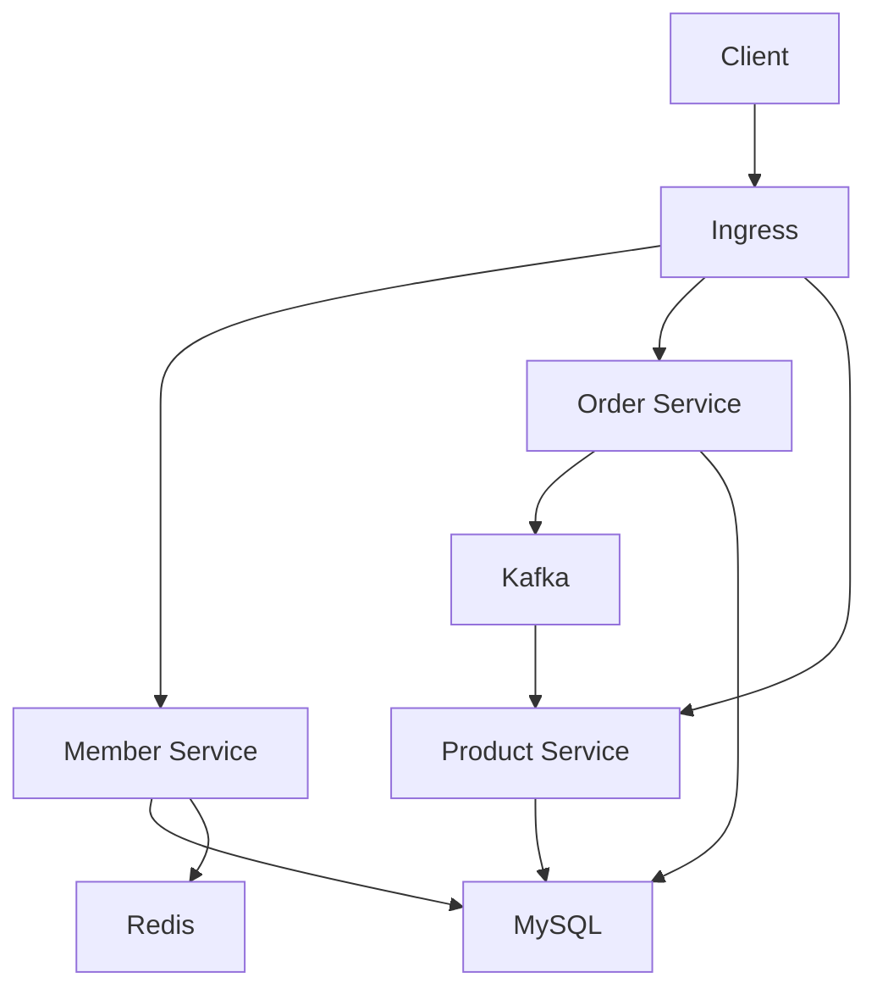
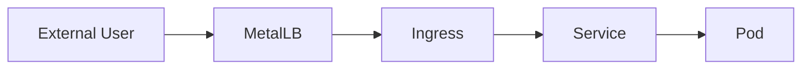
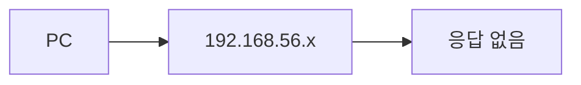
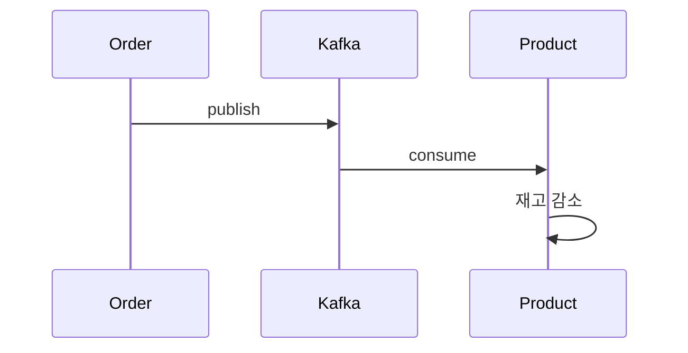

# 4. MSA 환경



## 4-1. 네임스페이스: deploy-test
```
kubectl create namespace deploy-test
```

## 4-2. deployment/service
### 4-2-1. 회원 서비스

- 로컬에서 이미지를 빌드한 이미지를 k8s에 직접 실행. CI/CD 환경은 추후 구성 예정

```bash
# docker desktop 실행 후 로컬에서 이미지 빌드
docker build -t member-service:latest .

# tar 파일로 저장
docker save -o member-service.tar member-service:latest

# w1-k8s, w2-k8s, w3-k8s로 전송
scp -P 60101 member-service.tar root@127.0.0.1:/root/
scp -P 60102 member-service.tar root@127.0.0.1:/root/
scp -P 60103 member-service.tar root@127.0.0.1:/root/

# w1-k8s, w2-k8s, w3-k8s 각 노드에서 아래 명령어를 실행해 Docker에 이미지 등록
docker load -i member-service.tar
```

- deployment, service 배포

```bash
# m-k8s에서 다음 명령어로 아래 depl_svc.yaml을 실행
kubectl apply -f deply_svc.yaml

# 확인
kubectl get pod -n deploy-test -o wide
kubectl get svc -n deploy-test
```

```yaml
# depl_svc.yaml

apiVersion: apps/v1
kind: Deployment
metadata:
  name: member-depl
  namespace: deploy-test
spec:
  replicas: 1
  selector:
    matchLabels:
      app: member
  template:
    metadata:
      labels:
        app: member
    spec:
      containers:
      - name: member-container
        image: member-service:latest
        imagePullPolicy: Never

        ports:
        - containerPort: 8080

        resources:
          limits:
            cpu: "250m"
            memory: "500Mi"
          requests:
            cpu: "100m"
            memory: "250Mi"

        env:
        - name: DB_HOST
          value: "mysql-master-0.mysql-master.deploy-test-data.svc.cluster.local"
        - name: DB_PW
          value: "rootpass"

        readinessProbe:
          httpGet:
            path: /health
            port: 8080
          initialDelaySeconds: 10
          periodSeconds: 10

---
apiVersion: v1
kind: Service
metadata:
  name: member-service
  namespace: deploy-test
spec:
  type: ClusterIP
  ports:
  - port: 80
    targetPort: 8080
  selector:
    app: member
```

## 4-3. 외부 연결
EKS에서는 LB가 자동으로 붙지만, 온프레미스 + VirtualBox + LB 없는 환경에서는 MetalLB + Ingress 조합을 사용해 외부의 요청을 처리할 수 있다. 



### 4-3-1. 전체 구조

```
외부 요청
   ↓
[ MetalLB (외부 IP 할당) ]
   ↓
[ Ingress Controller (Nginx) ]
   ↓
[ member-service (ClusterIP) ]
   ↓
[ member Pod ]
```

### 4-3-2. 전체 진행 순서
1️⃣ MetalLB 설치
2️⃣ IP Pool 설정
3️⃣ Ingress Controller 설치
4️⃣ Ingress 리소스 생성
5️⃣ hosts 설정
6️⃣ 접속 테스트

### 4-3-3. MetalLB 설치

```bash
# ✔️ v0.11.x 사용
kubectl apply -f https://raw.githubusercontent.com/metallb/metallb/v0.11.0/manifests/namespace.yaml
kubectl apply -f https://raw.githubusercontent.com/metallb/metallb/v0.11.0/manifests/metallb.yaml

# 설치 후 확인
kubectl get pods -n metallb-system
```

v0.11은 ConfigMap 방식으로 설정해야함. 아래 config를 적용한다

```bash
kubectl apply -f metallb-config.yaml
```

```yaml
# metalLB-config.yaml
apiVersion: v1
kind: ConfigMap
metadata:
  namespace: metallb-system
  name: config
data:
  config: |
    address-pools:
    - name: default
      protocol: layer2
      addresses:
      - 192.168.1.200-192.168.1.210
```

### 4-3-4. Ingress Controller 설치(Nginx)
```bash
# 구버전 ingress-nginx (k8s 1.17~1.18 호환)
kubectl apply -f https://raw.githubusercontent.com/kubernetes/ingress-nginx/controller-v0.41.2/deploy/static/provider/cloud/deploy.yaml

# 설치 확인
kubectl get svc -n ingress-nginx
kubectl get pods -n ingress-nginx
```

### 4-3-5. Ingress 리소스 생성

```bash
kubectl apply -f ingress.yaml
```

```yaml
apiVersion: networking.k8s.io/v1beta1
kind: Ingress
metadata:
  name: order-backend-ingress
  namespace: deploy-test
  annotations:
    kubernetes.io/ingress.class: nginx
    nginx.ingress.kubernetes.io/rewrite-target: /$2
    nginx.ingress.kubernetes.io/use-regex: "true"
spec:
  rules:
  - host: server.deploy-test.shop
    http:
      paths:
      - path: /member-service(/|$)(.*)
        backend:
          serviceName: member-service
          servicePort: 80

      - path: /ordering-service(/|$)(.*)
        backend:
          serviceName: ordering-service
          servicePort: 80

      - path: /product-service(/|$)(.*)
        backend:
          serviceName: product-service
          servicePort: 80
```

```bash
# 적용 후 확인
kubectl get ingress -n deploy-test
kubectl get svc -n ingress-nginx
```

### 4-3-6. 도메인 설정
로컬 PC에 host 설정
이 설정으로 ```server.deploy-test.shop```으로 들어온 요청은 실제 DNS에 등록이 안되어 있어 host 파일을 통해 ingress-nginx-controller의 EXTERNAL-IP인 192.168.x.x IP로 강제로 알려줌
```
C:\Windows\System32\drivers\etc\hosts 에서
192.168.1.202 server.deploy-test.shop 추가
192.168.x.x의 주소는 kubectl get svc -n ingress-nginx 실행 결과 LoadBalancer 타임의 EXTERNAL-IP를 참고
```

### 4-3-7. 연결 확인
postman으로 아래와 같이 ```POST http://server.deploy-test.shop/member-service/member/doLogin``` 요청 시 응답 확인

<figure>
  
  <p style="font-style: italic; color: gray;">member-service API 요청 결과</p>
</figure>

### 4-3-8. 연결 주의사항



아래와 같이 노드 IP 대역과 LoabBalancer(EXTERNAL-IP) 대역이 다르면 로컬 PC에서 보낸 API 요청이 노드에 전송되지 않는다.   

```bash
[root@m-k8s metalLB]# kubectl get nodes -o wide
NAME     STATUS   ROLES    AGE    VERSION   INTERNAL-IP     EXTERNAL-IP   OS-IMAGE                KERNEL-VERSION                CONTAINER-RUNTIME
m-k8s    Ready    master   313d   v1.18.4   192.168.1.10    <none>        CentOS Linux 7 (Core)   3.10.0-1160.90.1.el7.x86_64   docker://18.9.9
w1-k8s   Ready    <none>   313d   v1.18.4   192.168.1.101   <none>        CentOS Linux 7 (Core)   3.10.0-1160.90.1.el7.x86_64   docker://18.9.9
w2-k8s   Ready    <none>   313d   v1.18.4   192.168.1.102   <none>        CentOS Linux 7 (Core)   3.10.0-1160.90.1.el7.x86_64   docker://18.9.9
w3-k8s   Ready    <none>   313d   v1.18.4   192.168.1.103   <none>        CentOS Linux 7 (Core)   3.10.0-1160.90.1.el7.x86_64   docker://18.9.9

[root@m-k8s ordering-service]# kubectl get svc -n ingress-nginx
NAME                                 TYPE           CLUSTER-IP       EXTERNAL-IP      PORT(S)                      AGE
ingress-nginx-controller             LoadBalancer   10.109.70.19     192.168.56.202   80:30701/TCP,443:31605/TCP   5d21h
ingress-nginx-controller-admission   ClusterIP      10.101.148.210   <none>           443/TCP                      5d21h
```

L2(ARP) 레벨에서 패킷이 전달되지 않기 때문이다.   
MetalLB는 L2(ARP) 방식이고 MetalLB는 IP를 가지는 장비가 아니라 노드가 그 IP를 대신 응답하도록 만들어주는 역할이다.   
그리고 ARP는 같은 네트워크에서 IP → MAC 주소를 찾는 프로토콜이다. 이건 같은 네트워크(브로드캐스트 도메인)에서만 가능하다.   
MetalLB speaker는 자기 노드의 네트워크 인터페이스에서만 ARP 응답을 할 수 있다.   
위와 같이 노드 IP와 MetalLB External IP가 다르면 PC가 보낸 192.168.56.202 요청에 아무도 응답하지 않는다.   
실제 구조는 아래와 같다.   

```
// MetalLB 동작 방식
[내 PC]
   ↓
[192.168.56.202 ← 가상의 IP]
   ↓
[Node 중 하나가 대신 응답]
   ↓
[ingress-nginx Pod]
```

참고로 AWS Load Balancer와 같은 보편적인 LB는 실제 서비스/장비이고 트래픽을 MetalLB처럼 노드가 대신 받지 않고 LB가 직접 받는다.   
네트워크 방식은 L3/L4/L7 라우팅을 사용하고 노드와 동일한 네트워크일 필요가 없다.   

```
// AWS Load Balancer 동작 방식
[내 PC]
   ↓
(3.35.x.x ← 진짜 AWS LB IP)
   ↓
[AWS Load Balancer (실제 존재)]
   ↓
[EC2 / Pod]
```

이전 MetalLB 설정은 아래와 같이 ```192.168.56.200-192.168.56.210```으로 되어있어 External IP 잘못 설정 되었다.

```yaml
# metalLB-config.yaml
apiVersion: v1
kind: ConfigMap
metadata:
  namespace: metallb-system
  name: config
data:
  config: |
    address-pools:
    - name: default
      protocol: layer2
      addresses:
      - 192.168.56.200-192.168.56.210
```

아래와 같이 수정하고 명령어를 순서대로 실행해 적용한다.

```yaml
# metalLB-config.yaml
apiVersion: v1
kind: ConfigMap
metadata:
  namespace: metallb-system
  name: config
data:
  config: |
    address-pools:
    - name: default
      protocol: layer2
      addresses:
      - 192.168.1.200-192.168.1.210
```

```bash
kubectl delete pod -n metallb-system -l app=metallb
kubectl apply -f https://raw.githubusercontent.com/kubernetes/ingress-nginx/controller-v0.41.2/deploy/static/provider/cloud/deploy.yaml
kubectl get svc -n ingress-nginx
```

그러면 아래와 같이 노드와 같은 대역으로 External IP가 설정되고 로컬 PC에서 보내는 API 요청을 받을 수 있다.    

```bash
[root@m-k8s ~]# kubectl get svc -n ingress-nginx
NAME                                 TYPE           CLUSTER-IP       EXTERNAL-IP     PORT(S)                      AGE
ingress-nginx-controller             LoadBalancer   10.105.118.119   192.168.1.202   80:31872/TCP,443:32480/TCP   4s
ingress-nginx-controller-admission   ClusterIP      10.101.148.210   <none>          443/TCP                      5d22h
```

# 4. 그 외 deployment/service

주문, 제품 서비스의 빌드와 deployment, service 설치 방법은 회원 서비스와 동일하다.

## 4-1. 주문 서비스

```yaml
# depl_svc.yaml
apiVersion: apps/v1
kind: Deployment
metadata:
  name: ordering-depl
  namespace: deploy-test
spec:
  replicas: 1
  selector:
    matchLabels:
      app: ordering
  template:
    metadata:
      labels:
        app: ordering
    spec:
      containers:
      - name: ordering-container
        image: ordering-service:latest
        imagePullPolicy: Never

        ports:
        - containerPort: 8080
        
        resources:
        # 컨테이너가 사용할수 있는 리소스의 최대치
          limits:
            cpu: "250m"
            memory: "500Mi"
        # 컨테이너가 시작될떄 보장받아야 하는 최소 자원
          requests:
            cpu: "100m"
            memory: "250Mi"
        env:
        - name: DB_HOST
          value: "mysql-master-0.mysql-master.deploy-test-data.svc.cluster.local"
        - name: DB_PW
          value: "rootpass"
        
        # 컨테이너 상태 확인 
        readinessProbe:
          httpGet:
            # healthcheck 경로
            path: /health
            port: 8080
          # 컨테이너 시작 후 지연
          initialDelaySeconds: 10
          # 확인 반복 주기
          periodSeconds: 10

---
apiVersion: v1
kind: Service
metadata:
  name: ordering-service
  namespace: deploy-test
spec:
  type: ClusterIP
  ports:
  - port: 80
    targetPort: 8080
  selector:
    app: ordering

```

## 4-2. 제품 서비스

```yaml
# depl_svc.yaml
apiVersion: apps/v1
kind: Deployment
metadata:
  name: product-depl
  namespace: deploy-test
spec:
  replicas: 1
  selector:
    matchLabels:
      app: product
  template:
    metadata:
      labels:
        app: product
    spec:
      containers:
      - name: product-container
        image: product-service:latest
        imagePullPolicy: Never
        ports:
        - containerPort: 8080
        resources:
        # 컨테이너가 사용할수 있는 리소스의 최대치
          limits:
            cpu: "250m"
            memory: "500Mi"
        # 컨테이너가 시작될떄 보장받아야 하는 최소 자원
          requests:
            cpu: "100m"
            memory: "250Mi"
        env:
        - name: DB_HOST
          value: "mysql-master-0.mysql-master.deploy-test-data.svc.cluster.local"
        - name: DB_PW
          value: "rootpass"
        # 컨테이너 상태 확인 
        readinessProbe:
          httpGet:
            # healthcheck 경로
            path: /health
            port: 8080
          # 컨테이너 시작 후 지연
          initialDelaySeconds: 10
          # 확인 반복 주기
          periodSeconds: 10

---
apiVersion: v1
kind: Service
metadata:
  name: product-service
  namespace: deploy-test
spec:
  type: ClusterIP
  ports:
  - port: 80
    targetPort: 8080
  selector:
    app: product

```

## 4-5. 멤버, 제품, 주문 서비스 실행 결과

### 4-5-1. 멤버 서비스

로그인
<figure>
  
  <p style="font-style: italic; color: gray;">로그인</p>
</figure>

### 4-5-2. 제품 서비스

제품 등록
<figure>
  
  <p style="font-style: italic; color: gray;">제품 등록 API</p>
</figure>

<figure>
  
  <p style="font-style: italic; color: gray;">제품 DB 등록</p>
</figure>

### 4-5-3. 주문 서비스

제품 주문 후 수량 확인   
제품을 주문하면 Kafka의 update-stock-topic 토픽에 주문 메시지를 pub하고 제품 서비스에서 sub 해서 주문 수량 만큼 재고를 줄인다.   



<figure>
  
  <p style="font-style: italic; color: gray;">제품 주문</p>
</figure>

<figure>
  
  <p style="font-style: italic; color: gray;">제품 주문 후 수량</p>
</figure>
