# 현재 구조도

```mermaid
flowchart TD

    %% =====================================================
    %% Developer
    %% =====================================================

    DEV[Developer]

    %% =====================================================
    %% GitHub
    %% =====================================================

    subgraph GITHUB["GitHub"]

        direction TB

        APP_REPO["Application Repositories
        - deploy-test-member
        - deploy-test-ordering
        - deploy-test-product"]

        MANIFEST_REPO["GitOps Repository
        - deploy-test-manifest"]

    end

    %% =====================================================
    %% Local PC Windows
    %% =====================================================

    subgraph LOCAL["Local PC Windows"]

        direction TB

        subgraph DOCKER["Docker Desktop"]

            direction TB

            JENKINS["Jenkins Container"]

            HARBOR["Harbor Registry
            192.168.56.1:8080"]

            subgraph PIPELINE["Jenkins CI Pipeline"]

                direction TB

                GIT_CLONE["1. Git Clone"]

                GRADLE["2. Gradle Build"]

                DOCKER_BUILD["3. Docker Build"]

                HARBOR_PUSH["4. Harbor Push"]

                UPDATE_MANIFEST["5. deployment.yaml
                image tag 변경"]

            end

        end

        HOSTS["hosts 설정
        server.deploy-test.shop
        argocd.deploy-test.shop"]

    end

    %% =====================================================
    %% Oracle VM + Kubernetes
    %% =====================================================

    subgraph VM["Oracle VM VirtualBox + Vagrant"]

        direction TB

        subgraph K8S["Kubernetes Cluster"]

            direction TB

            %% =============================================
            %% Infra
            %% =============================================

            subgraph INFRA["Cluster Infra"]

                direction TB

                METALLB["MetalLB
                192.168.1.200~210"]

                INGRESS["Nginx Ingress Controller"]

                ARGOCD["ArgoCD"]

            end

            %% =============================================
            %% Services
            %% =============================================

            subgraph DEPLOY["Namespace : deploy-test"]

                direction TB

                MEMBER_SVC["member-service"]
                MEMBER_DEPLOY["member-depl"]

                ORDERING_SVC["ordering-service"]
                ORDERING_DEPLOY["ordering-depl"]

                PRODUCT_SVC["product-service"]
                PRODUCT_DEPLOY["product-depl"]

            end

            %% =============================================
            %% Worker Nodes
            %% =============================================

            subgraph NODES["Worker Nodes"]

                direction TB

                W1["w1-k8s"]

                W2["w2-k8s"]

                W3["w3-k8s"]

            end

            %% =============================================
            %% Database
            %% =============================================

            subgraph DB["Namespace : deploy-test-data"]

                direction TB

                MYSQL_MASTER["mysql-master"]

                MYSQL_SLAVE["mysql-slave"]

            end

        end

    end

    %% =====================================================
    %% User
    %% =====================================================

    USER["Browser / API Client"]

    %% =====================================================
    %% CI Flow
    %% =====================================================

    DEV -->|git push| APP_REPO

    APP_REPO --> JENKINS

    JENKINS --> GIT_CLONE
    GIT_CLONE --> GRADLE
    GRADLE --> DOCKER_BUILD
    DOCKER_BUILD --> HARBOR_PUSH

    HARBOR_PUSH --> HARBOR

    JENKINS --> UPDATE_MANIFEST

    UPDATE_MANIFEST --> MANIFEST_REPO

    %% =====================================================
    %% GitOps Flow
    %% =====================================================

    MANIFEST_REPO --> ARGOCD

    ARGOCD --> MEMBER_DEPLOY
    ARGOCD --> ORDERING_DEPLOY
    ARGOCD --> PRODUCT_DEPLOY

    %% =====================================================
    %% Deployment Scheduling
    %% =====================================================

    MEMBER_DEPLOY --> W2
    ORDERING_DEPLOY --> W1
    PRODUCT_DEPLOY --> W3

    %% =====================================================
    %% Image Pull
    %% =====================================================

    W1 -. image pull .-> HARBOR
    W2 -. image pull .-> HARBOR
    W3 -. image pull .-> HARBOR

    %% =====================================================
    %% Service Traffic Flow
    %% =====================================================

    USER --> HOSTS

    HOSTS --> METALLB

    METALLB --> INGRESS

    INGRESS --> MEMBER_SVC
    INGRESS --> ORDERING_SVC
    INGRESS --> PRODUCT_SVC

    MEMBER_SVC --> MEMBER_DEPLOY
    ORDERING_SVC --> ORDERING_DEPLOY
    PRODUCT_SVC --> PRODUCT_DEPLOY

    %% =====================================================
    %% DB Connection
    %% =====================================================

    MEMBER_DEPLOY --> MYSQL_MASTER
    ORDERING_DEPLOY --> MYSQL_MASTER
    PRODUCT_DEPLOY --> MYSQL_MASTER

    MYSQL_SLAVE --> MYSQL_MASTER

    %% =====================================================
    %% ArgoCD UI
    %% =====================================================

    USER -->|argocd.deploy-test.shop| ARGOCD
```

# 7. Helm 도입

# 8. 모니터링
## 8-1. Prometheus

## 8-2. Grafana

# 9. LGTM 로그 수집

# 10. 그 외
1. Kubernetes 버전 업

2. 시크릿 설정 

3. HTTPS 통신 

4. DB 이중화 연결 

5. 서비스용 DB 계정 생성 

6. 젠킨스, harbor 구성 

7. HPA