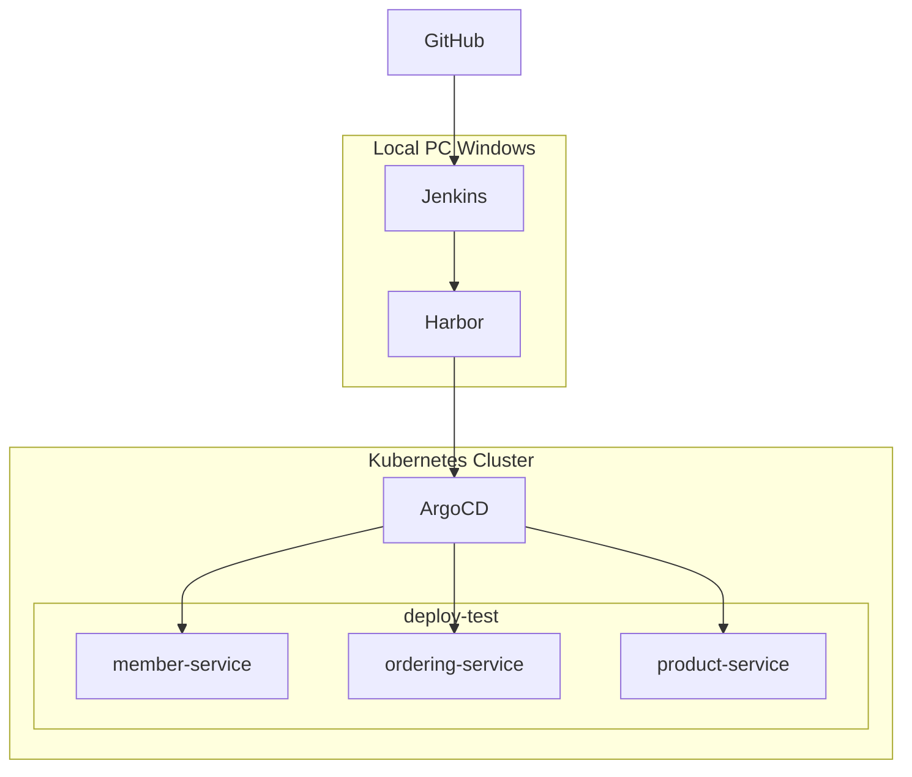
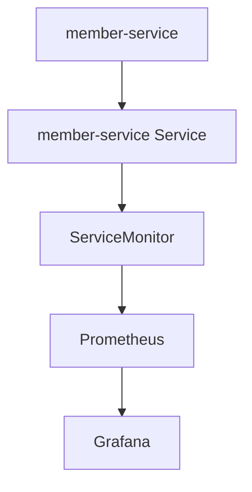

# 8. Monitoring
## 8-1. Prometheus
Prometheus는 CNCF(Cloud Native Computing Foundation)에서 관리하는 오픈소스 모니터링 시스템이다.   
Kubernetes 환경에서 가장 많이 사용되는 모니터링 도구이며, 다양한 애플리케이션과 인프라의 메트릭(Metric)을 수집하고 저장한다.   
Prometheus의 주요 특징은 다음과 같다.   

* Pull 방식의 메트릭 수집
* 시계열 데이터 저장
* PromQL 제공
* Kubernetes와 높은 통합성
* AlertManager 연동 가능

현재 구축된 환경은 다음과 같다.



여기에 Prometheus와 Grafana를 m-k8s 노드에 추가한다.   

### 8-1-1. Prometheus 설치

1. Helm Repository 추가
> Prometheus Community Repository를 등록한다.   
> 
> ```bash
> helm repo add prometheus-community https://prometheus-community.github.io/helm-charts
> 
> helm repo update
> ```

2. kube-prometheus-stack 설치
> 현재 Kubernetes 버전은 1.18 환경이다.   
> 최신 버전의 kube-prometheus-stack은 Kubernetes 1.25 이상을 요구하므로 설치 시 다음과 같은 오류가 발생한다.   
> 
> ```text
> Error: INSTALLATION FAILED:
> chart requires kubeVersion: >=1.25.0-0
> which is incompatible with Kubernetes v1.18.20
> ```
> 
> 따라서 Kubernetes 1.18과 호환되는 버전을 설치해야 한다.   
> 
> 네임스페이스 생성   
> 
> ```bash
> kubectl create namespace monitoring
> ```
> 
> 차트 설치   
> 
> ```bash
> helm install monitoring \
> prometheus-community/kube-prometheus-stack \
> --version 35.6.2 \
> -n monitoring
> ```
> 
> 설치 확인   
> 
> ```bash
> kubectl get pods -n monitoring
> ```

3. Prometheus와 Grafana 확인
> 배포 상태 확인   
> 
> ```bash
> kubectl get pods -n monitoring
> ```
> 
> 예시   
> 
> ```text
> alertmanager-monitoring-kube-prometheus-alertmanager-0
> 
> monitoring-grafana
> 
> monitoring-kube-prometheus-operator
> 
> monitoring-kube-state-metrics
> 
> prometheus-monitoring-kube-prometheus-prometheus-0
> ```
> 
> Helm 설치 확인   
> 
> ```bash
> helm list -A
> ```

### 8-1-2. Prometheus, Grafana 접속 설정

Prometheus와 Grafana를 설치한 후에는 외부 브라우저에서 접근할 수 있도록 Ingress를 생성한다.  
현재 환경에서는 NGINX Ingress Controller와 MetalLB를 사용하고 있으므로 DNS 대신 hosts 파일을 이용하여 도메인을 매핑한다.   

1. Prometheus, Grafana 서비스 확인
> 먼저 Prometheus Service를 확인한다.   
> 
> ```bash
> kubectl get svc -n monitoring
> ```
> 
> 예시   
> 
> ```text
> NAME                                            TYPE        CLUSTER-IP
> monitoring-kube-prometheus-prometheus           ClusterIP   10.103.211.121
> ```
> 
> 이어서 Grafana Service를 확인한다.   
> 
> ```bash
> kubectl get svc -n monitoring
> ```
> 
> 예시   
> 
> ```text
> NAME                 TYPE        CLUSTER-IP
> monitoring-grafana   ClusterIP   10.105.88.143
> ```

2. Prometheus Ingress 생성
> ```yaml
> # prometheus-ingress.yaml
> 
> apiVersion: networking.k8s.io/v1beta1
> kind: Ingress
> metadata:
>   name: prometheus-ingress
>   namespace: monitoring
> 
>   annotations:
>     kubernetes.io/ingress.class: nginx
> 
> spec:
>   rules:
>   - host: prometheus.deploy-test.shop
>     http:
>       paths:
>       - path: /
>         backend:
>           serviceName: monitoring-kube-prometheus-prometheus
>           servicePort: 9090
> ```
> 
> ```bash
> # 적용
> kubectl apply -f prometheus-ingress.yaml
> ```

3. Grafana Ingress 생성
> ```yaml
> # grafana-ingress.yaml
> 
> apiVersion: networking.k8s.io/v1beta1
> kind: Ingress
> metadata:
>   name: grafana-ingress
>   namespace: monitoring
> 
>   annotations:
>     kubernetes.io/ingress.class: nginx
> 
> spec:
>   rules:
>   - host: grafana.deploy-test.shop
>     http:
>       paths:
>       - path: /
>         backend:
>           serviceName: monitoring-grafana
>           servicePort: 80
> ```
> 
> ```bash
> # 적용
> kubectl apply -f grafana-ingress.yaml
> ```

4. Ingress 확인
> ```bash
> kubectl get ingress -n monitoring
> ```
> 
> 예시   
> 
> ```text
> NAME                 HOSTS
> prometheus-ingress   prometheus.deploy-test.shop
> grafana-ingress      grafana.deploy-test.shop
> ```

5. Windows Hosts 설정
> 로컬 PC에서 도메인으로 접속하기 위해 ```C:\Windows\System32\drivers\etc\hosts``` 파일에 아래 내용을 추가한다.   
> 
> ```text
> 192.168.1.202 prometheus.deploy-test.shop
> 192.168.1.202 grafana.deploy-test.shop
> ```
> 
> ※ 192.168.56.202은 MetalLB가 할당한 Ingress External IP이다. 환경에 따라 IP는 달라질 수 있다.   

6. Prometheus 접속
> 브라우저에서 ```http://prometheus.deploy-test.shop``` 주소로 접속한다.   
> 
> <figure>
>   
>   <p style="font-style: italic; color: gray;">Prometheus 접속</p>
> </figure>

7. Grafana 접속
> Grafana 로그인 계정   
> 
> ```text
> ID : admin
> ```
> 
> 비밀번호 확인   
> 
> ```bash
> kubectl get secret monitoring-grafana -n monitoring -o jsonpath="{.data.admin-password}" | base64 --decode
> ```
> 
> <figure>
>   
>   <p style="font-style: italic; color: gray;">Grafana 접속</p>
> </figure>

### 8-1-2. Spring Boot Actuator 설정

Prometheus가 Spring Boot 메트릭을 수집하기 위해서는 Actuator와 Micrometer가 필요하다.   
서비스의 ```build.gradle```에 아래 의존성을 추가한다.   

```gradle
implementation 'org.springframework.boot:spring-boot-starter-actuator'
implementation 'io.micrometer:micrometer-registry-prometheus'
```

그리고 ```application.yaml```에 아래와 같이 메트릭 정보를 노출하는 설정을 추가한다.   
애플리케이션 내부에서 JVM, CPU, 메모리, HTTP 요청 등의 메트릭을 수집해 ```/actuator/prometheus``` API로 노출한다.   

```yaml
management:
  endpoints:
    web:
      exposure:
        include: health,prometheus

  endpoint:
    health:
      show-details: always
```

배포 후 확인   

```bash
curl http://member-service/actuator/prometheus
```

정상이라면 다음과 같은 결과가 출력된다.

```text
# HELP jvm_memory_used_bytes
# TYPE jvm_memory_used_bytes gauge
```

### 8-1-3. ServiceMonitor
Prometheus Operator 환경에서는 ServiceMonitor가 매우 중요하다.   
일반적인 Prometheus는 prometheus.yml 파일에 직접 scrape 대상을 등록한다.   

```yaml
scrape_configs:
  - job_name: member-service
```

하지만 Kubernetes에서는 Pod와 Service가 계속 생성되고 삭제된다.   
따라서 고정 설정 방식은 관리가 어렵다.   
Prometheus Operator는 ServiceMonitor를 통해 수집 대상을 자동으로 관리한다.   

```text
ServiceMonitor
       ↓
Service
       ↓
Pod
       ↓
Actuator Endpoint
```

ServiceMonitor는 "어떤 Service의 어떤 Endpoint를 수집할 것인가" 를 정의하는 Kubernetes 리소스이다.   
ServiceMonitor는 아래 과정으로 애플리케이션의 메트릭 정보를 수집한다.   

```text
Spring Boot
      ↓
Micrometer
      ↓
Actuator
      ↓
/actuator/prometheus
      ↓
ServiceMonitor
      ↓
Prometheus
      ↓
Grafana
```

### 8-1-4. ServiceMonitor 생성

member-service 메트릭 수집을 위해 아래와 같이 ServiceMonitor 리소스를 생성한다.   

```yaml
# servicemonitor.yaml

apiVersion: monitoring.coreos.com/v1
kind: ServiceMonitor

metadata:
  name: member-service
  namespace: monitoring

  labels:
    release: monitoring

spec:
  selector:
    matchLabels:
      app: member

  namespaceSelector:
    matchNames:
      - deploy-test

  endpoints:
    - port: http
      path: /actuator/prometheus
      interval: 15s
```

manifest 레포지토리의 ```member-chart/templates/servicemonitor.yaml```을 생성하고 push 하면 ArgoCD가 ServiceMonitor를 생성한다.   

<figure>
  
  <p style="font-style: italic; color: gray;">ServiceMonitor 적용</p>
</figure>

### 8-1-5. Service Label 설정

ServiceMonitor는 Service Label을 기준으로 Service를 찾는다.   

```yaml
apiVersion: v1
kind: Service

metadata:
  name: member-service
  namespace: deploy-test
  labels:
    app: member

spec:
  type: {{ .Values.service.type }}
  ports:
    - name: http
      protocol: TCP
      port: {{ .Values.service.port }}
      targetPort: {{ .Values.service.targetPort }}
  selector:
    app: member
```

```yaml
selector:
  app: member
```

는 Pod를 찾기 위한 설정이므로 ServiceMonitor가 Service를 찾기 위해 아래 설정을 추가해야 한다.   

```yaml
metadata:
  labels:
    app: member
```

### 8-1-6. 최종 구조

member-service에서 메트릭 정보를 ```/actuator/prometheus```로 제공하고 Prometheus는 ```ServiceMonitor```를 통해 메트릭을 수집한다.   



수집한 메트릭 정보는 아래와 같이 확인할 수 있다.   

<figure>
  
  <p style="font-style: italic; color: gray;">전체 HTTP 요청 수</p>
</figure>

이어서 수집한 지표들을 Grafana에서 대시보드로 표현한다.   

## 8-2. Grafana
Grafana는 수집된 메트릭을 시각화하는 오픈소스 대시보드 플랫폼이다.   
Prometheus가 메트릭을 저장하는 역할을 한다면 Grafana는 데이터를 보기 쉽게 표현하는 역할을 수행한다.   

```text
Application
      ↓
Prometheus
      ↓
Grafana
```

# 9. LGTM 로그 수집

# 10. 그 외
1. Kubernetes 버전 업

2. 시크릿 설정 

3. HTTPS 통신 

4. DB 이중화 연결 

5. 서비스용 DB 계정 생성 

6. 젠킨스, harbor 구성 

7. HPA